---

published: true                        # Optional. Set to true to publish the workshop (default: false)
type: workshop                          # Required.
title: Building Fabric Real-Time Intelligence solution in a day               # Required. Full title of the workshop
short_title: Microsoft Fabric Real-Time Intelligence Tutorial    # Optional. Short title displayed in the header
description: In this technical workshop, you will build a complete analytics platform with streaming data using Microsoft Fabric Real-Time Intelligence components and other features of Microsoft Fabric. This is a proctor led worksop in which each section is accompanied by a technical overview of Fabric RTI components.   # Required.
level: intermediate                         # Required. Can be 'beginner', 'intermediate' or 'advanced'
authors:                                # Required. You can add as many authors as needed      
  - Microsoft Fabric Real-Time Intelligence
contacts: # Required. Must match the number of authors
  - https://aka.ms/fabricblog
duration_minutes: 360 # Required. Estimated duration in minutes
audience: students, pro devs, analysts # Optional. Audience of the workshop (students, pro devs, etc.)
tags: fabric, kql, realtime, intelligence, event, stream, sql, data, analytics, kusto, medallion, dashboard, reflex, activator # Required. Tags for filtering and searching
---

# Introduction

Suppose you own an e-commerce website selling bike accessories. You have millions of visitors a month, you want to analyze the website traffic, consumer patterns and predict sales.

This workshop will walk you through the process of building an end-to-end [Real-Time Intelligence](https://blog.fabric.microsoft.com/en-us/blog/introducing-real-time-intelligence-in-microsoft-fabric) Solution in MS Fabric, using the medallion architecture, for your e-commerce website.

You will learn how to:

- Build a web traffic analytics solution using Fabric Real-Time Intelligence.
- Use Fabric shortcuts to query data without move or copy(with AdventureWorksLT sample data).
- Stream events into Fabric Eventhouse via Eventstream & leverage OneLake availability.
- Create real-time data transformations in Fabric Eventhouse through the power of Kusto Query Language (KQL) & Fabric Copilot.
- Create real-time visualizations using Real-Time Dashboards.
- Build Reflex actions and alerts on the streaming data.

See what real customers like [McLaren](https://www.linkedin.com/posts/shahdevang_if-you-missed-flavien-daussys-story-at-build-activity-7199013652681633792-3hdp), [Dener Motorsports](https://customers.microsoft.com/en-us/story/1751743814947802722-dener-motorsport-producose-ltd-azure-service-fabric-other-en-brazil), [Elcome](https://customers.microsoft.com/en-us/story/1770346240728000716-elcome-microsoft-copilot-consumer-goods-en-united-arab-emirates), [Seair Exim Solutions](https://customers.microsoft.com/en-us/story/1751967961979695913-seair-power-bi-professional-services-en-india) & [One NZ](https://customers.microsoft.com/en-us/story/1736247733970863057-onenz-powerbi-telecommunications-en-new-zealand) are saying.

All the **code** in this tutorial can be found here:  
[Build Fabric Real-Time Intelligence solution in a day](https://github.com/microsoft/FabConRTITutorial/)

## Duration

- Workshop 5-6 hours.
- Each section is accompanied with technical explanation of the Fabric Real-Time Intelligence component being used.
- Without the accompanied explanation, lab can be completed in 1-2 hours.
- **TO BE CHANGED** [pre-reqs](https://moaw.dev/workshop/?src=gh%3Amicrosoft%2FFabricRTIWorkshop%2Fmain%2Fdocs%2F&step=6) 30-45 minutes (section 7, recommend provisioning trial tenant prior if necessary).

## Original Creators

This workshop/tutorial was originally written by the following authors and is available at [Fabric-RTI-Workshop](https://aka.ms/fabricrtiworkshop)

- [Denise Schlesinger](https://github.com/denisa-ms), Microsoft, Principal CSA
- [Hiram Fleitas](https://aka.ms/hiram), Microsoft, Senior CSA
- Guy Yehudy, Microsoft, Principal PM

## Authors

- [Brian Bønk Rueløkke](https://www.linkedin.com/in/brianbonk/), Data Platform MVP
- [Devang Shah](https://www.linkedin.com/in/shahdevang/), Principal Program Manager, Microsoft
- [Frank Geisler](https://www.linkedin.com/in/frank-geisler/), Data Platform MVP
- [Johan Ludvig Brattås](https://www.linkedin.com/in/johanludvig/), Data Platform MVP
- [Matt Gordon](https://www.linkedin.com/in/sqlatspeed/), Data Platform MVP

## Contributing

- If you'd like to contribute to this lab, report a bug or issue, please feel free to submit a Pull-Request to the [GitHub repo](https://github.com/microsoft/FabConRTITutorial/) for us to review or [submit Issues](https://github.com/microsoft/FabConRTITutorial/issues) you encounter.

---

## Fabric Real-Time Intelligence

Let's cover the key-features of Real-Time Intelligence and how we plan to use them for our architecture.

### Eventstreams

- Eventstreams allow us to bring real-time events (including Kafka endpoints) into Fabric, transform them, and then route them to various destinations without writing any code (no-code).

- In this solution, Clicks and Impressions events are ingested from an Eventstream into the respective 'BronzeClicks' and 'BronzeImpressions' tables.

- Enhanced capabilities allows us to source data into Eventstreams from Azure Event Hubs, IoT Hubs, Azure SQL Database (CDC), PostgreSQL Database (CDC), MySQL Database (CDC), Azure Cosmos Database (CDC), Google Cloud Pub/Sub, Amazon Kinesis Data Streams, Confluent Cloud Kafka, Azure Blog Storage events, Fabric Workspace Item events, Sample data or Custom endpoint (Custom App).

- Feature [documentation](https://learn.microsoft.com/fabric/real-time-analytics/event-streams/overview).

### Shortcuts

- Shortcuts enable the creation of a live connections between OneLake and data sources, whether internal or external to Azure. This allows us to retrieve data from these locations as if they were seamlessly integrated into Microsoft Fabric.

- A shortcut is a schema entity that references data stored external to a KQL database in your cluster. In Lakehouse(s), Eventhouse(s), or KQL Databases it's possible to create shortcuts referencing internal locations within Microsoft Fabric, ADLS Gen2, Spark Notebooks, AWS S3 storage accounts, or Microsoft Dataverse.

- By enabling us to reference different storage locations, OneLake's Shortcuts provides a unified source of truth for all our data, within the Microsoft Fabric environment and ensures clarity regarding the origin of our data.

- In this solution, the `Product` and `ProductCategory` delta tables in OneLake are defined as external tables using shortcuts. Meaning the data is not copied but served from the OneLake itself. Shortcuts allow data to remain stored in outside of Fabric, yet presented via Fabric as a central location.

- Feature [documentation](https://learn.microsoft.com/fabric/real-time-analytics/onelake-shortcuts?tabs=onelake-shortcut).

### Eventhouse

- An Eventhouse can host multiple KQL Databases for easier management. It will store events data from the Eventstream, leverage shortcuts and automate transformations in real-time. Eventhouses are **specifically tailored** to time-based, streaming or batch events with structured, semi-structured, and unstructured data.

- An Eventhouse is the best place to store streaming data in Fabric. It provides a highly scalable analytics system with built-in Machine Learning capabilities for discrete analytics over highly-granular data. It's useful for any scenario that includes event-based data, for example, telemetry and log data, time series and IoT data, security and compliance logs, or financial records.

- Eventhouse's support Kusto Query Language (KQL) queries, T-SQL queries and Python. The data is automatically made available in delta-parquet format and can be easily accessed from Notebooks for more advanced transformations.

- Feature [documentation](https://learn.microsoft.com/fabric/real-time-intelligence/eventhouse).

### KQL Update policies

- This feature is also known as a mini-ETL. Update policies are automation mechanisms, triggered when new data is written to a table. They eliminate the need for external orchestration by automatically running a query to transform the ingested data and save the result to a destination table.

- Multiple update policies can be defined on a single table, allowing for different transformations and saving data to multiple tables simultaneously. **Target** tables can have a different schema, retention policy, and other policies than the **Source** table.

- In this solution, the data in derived silver layer tables (targets) of our medallion architecture is inserted upon ingestion into bronze tables (sources). Using Kusto's update policy feature, this appends transformed rows in real-time into the target table, as data is landing in a source table. This can also be set to run in as a transaction, meaning if the data from bronze fails to be transformed to silver, it will not be loaded to bronze either. By default, this is set to off allowing maximum throughput.

- Feature [documentation](https://learn.microsoft.com/azure/data-explorer/kusto/management/update-policy).

### KQL Materialized Views

- Materialized views expose an aggregation query over a source table, or over another materialized view. We will use materialized views to create the Gold Layer in our medallion architecture. Most common materialized views provide the current reading of a metric or statistics of metrics over time. They can also be backfilled with historical data; however, by default they are automatically populated by newly ingested data.

- Feature [documentation](https://learn.microsoft.com/azure/data-explorer/kusto/management/materialized-views/materialized-view-overview).

### One Logical Copy

- This feature creates a one logical copy of KQL Database data by turning on OneLake availability. Turning on OneLake availability for your KQL tables, database or Eventhouse means that you can query the data in your KQL database in Delta Lake format via other Fabric engines such as Direct Lake mode in Power BI, Warehouse, Lakehouse, Notebooks, and more. When activated, it will copy via mirroring the KQL data to your Fabric Datalake in delta-parquet format. Allowing you to shortcut tables from your KQL Database via OneLake to your Fabric Lakehouse, Data Warehouse, and also query the data in delta-parquet format using Spark Notebooks or the SQL-endpoint of the Lakehouse.

- Feature [documentation](https://learn.microsoft.com/fabric/real-time-analytics/one-logical-copy).

### KQL Dynamic fields

- Dynamic fields are a powerful feature of KQL database's that support evolving schema changes and object polymorphism, allowing the storage/querying of different event types that have a common denominator of base fields.

- Feature [documentation](https://learn.microsoft.com/azure/data-explorer/kusto/query/scalar-data-types/dynamic).

### Kusto Query Language (KQL)

- KQL is also known as the language of the cloud. It's available in many other services such as Microsoft Sentinel, Azure Monitor, Azure Resource Graph and Microsoft Defender. The code-name **Kusto** engine was invented by 4 engineers from the Power BI team over 10 years ago and has been implemented across all Microsoft services including Github Copilot, LinkedIn, Azure, Office 365, and XBOX.

- KQL queries are easy to write, read and edit. The language is most commonly used to analyze logs, sign-on events, application traces, diagnostics, signals, metrics and much more. Supports multi-statement queries, relational operators such as filters (where clauses), union, joins aggregations to produce a tabular output. It allows the ability to simply pipe (|) additional commands for ad-hoc analytics without needing to re-write entire queries. It has similarities to PowerShell, Excel functions, LINQ, function SQL, and OS Shell (Bash). It supports DML statements, DDL statements (referred to as Control Commands), built-in machine learning operators for forecasting & anomaly detection, plus more... including in-line Python & R-Lang.

- In this solution, KQL commands will be automatically created and executed by eventstream to ingest data when configuring the Eventhouse KQL Database destination in the Eventstream. These commands will create the respective 'bronze' tables. Secondly, the control commands will be issued in a database script that automate creation of additional schema items such as Tables, Shortcuts, Functions, Policies and Materialized-Views.
- Feature [documentation](https://learn.microsoft.com/azure/data-explorer/kusto/query/).

### Real-Time Dashboards

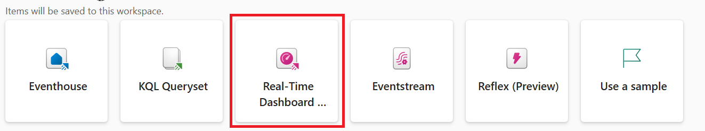

- While similar to Power BI's dashboard functionality, Real-time Dashboards have a different use case. Real-time Dashboards are commonly used for operational decision making, rather than the business intelligence use cases Power BI targets. Power BI supports more advanced visualizations and provides a rich data-story capabilities. Real-time Dashboards refresh very fast and allow with ease to toggle between visuals, and analysts to pro-developer can explore/edit queries without needing to download a desktop tool. This makes the experience simpler for analysts to understand and visualize large volumes of highly-granular data.

- In this solution, the Real-time dashboard will contain a collection of visual tiles _Click Through Rate_ stat KPIs, _Impressions_ area chart, _Clicks_ area chart, _Impressions by Location_ map for geo-spatial analytics and _Average Page Load Time_ in a line chart. This feature supports filter parameters, additional pages, markdown tiles, including Plotly, multiple KQL datasources, base queries, embedding.

- Real-time Dashboard's also support sharing while retaining permission controls, setting of alerts via Data Activator, and automatic refresh with a minimum frequency of 30 seconds.

- Feature [documentation](https://learn.microsoft.com/fabric/real-time-intelligence/dashboard-real-time-create).

### Data Activator

- Data Activator (code-name Reflex) is a no-code experience in Microsoft Fabric for automatically taking actions when patterns or conditions are detected in changing data. It monitors data in Power BI reports, Eventstreams items and Real-time Dashboards, for when the data hits certain thresholds or matches other patterns. It then triggers the appropriate action, such as alerting users or kicking off Power Automate workflows.

- Some common use cases are:

  - Run Ads when same-store sales decline.
  - Alert store managers to move food from failing freezers before it spoils.
  - Retain customers who had a bad experience by tracking their journey through apps, websites etc.
  - Help logistics companies find lost shipments proactively by starting an investigation when package status isn't updated for a certain length of time.
  - Alert account teams when customers fall behind with conditional thresholds.
  - Track data pipeline quality, to either re-run jobs, alert for detected failures or anomalies.

- In this solution, we will set an alert in our Real-time Dashboard to **Message me in Teams** functionality.

- Feature [documentation](https://learn.microsoft.com/fabric/data-activator/data-activator-introduction).

### Copilot

- Copilot for Real-Time Intelligence is an advanced AI tool designed to help you explore your data and extract valuable insights. You can input questions about your data, which are then automatically translated into Kusto Query Language (KQL) queries. Copilot streamlines the process of analyzing data for both experienced KQL users and citizen data scientists.

- Feature [documentation](https://learn.microsoft.com/fabric/get-started/copilot-real-time-intelligence).

  

---

## The e-commerce store

The e-commerce store database entities are:

- **Product:** the product catalogue.
- **ProductCategory:** the product categories.
- **events:** a click or impression event.

  - An **impression event** is logged when a product appears in the search results.

    

  - A **click event** is logged when the product is clicked and the customer has viewed the details.

    

    Photo by [Himiway Bikes](https://unsplash.com/@himiwaybikes?utm_content=creditCopyText&utm_medium=referral&utm_source=unsplash) on [Unsplash](https://unsplash.com/photos/black-and-gray-motorcycle-parked-beside-brown-wall-Gj5PXw1kM6U?utm_content=creditCopyText&utm_medium=referral&utm_source=unsplash).  
    Photo by [HEAD Accessories](https://unsplash.com/@headaccessories?utm_content=creditCopyText&utm_medium=referral&utm_source=unsplash) on [Unsplash](https://unsplash.com/photos/silver-and-orange-head-lamp-9uISZprJdXU?utm_content=creditCopyText&utm_medium=referral&utm_source=unsplash).  
    Photo by [Jan Kopřiva](https://unsplash.com/@jxk?utm_content=creditCopyText&utm_medium=referral&utm_source=unsplash) on [Unsplash](https://unsplash.com/photos/a-close-up-of-a-helmet-with-sunglasses-on-it-CT6AScSsQQM?utm_content=creditCopyText&utm_medium=referral&utm_source=unsplash).

---

## Architecture

### Components of Fabric's Real-Time Intelligence


Real-Time Intelligence allows organizations to ingest, process, analyze and, questions over your data using natural language, transform and automatically act on data. All with a central hub (Real-Time Hub) to easily access and visualize all internal and external, first- and third-party streaming data.

Using Real-Time Intelligence enables faster, more accurate decision-making and accelerated time to insight.

## Lab Architecture


Now with Data Activator (Reflex), we can also set alerts on Real-time Dashboards to send a message in Teams with conditional thresholds or even more advanced actions.

---

## Data schema

### Data flow


### Tables

| Table                 | Origin           | Description                                                                                                                                                                                                                                 |
| --------------------- | ---------------- | ------------------------------------------------------------------------------------------------------------------------------------------------------------------------------------------------------------------------------------------- |
| **BronzeClicks**      | Eventhouse table | Streaming events representing the product being seen or clicked by the customer. Will be streamed into Fabric Eventhouse from an eventstream. We'll use a Fabric Notebook to simulate and push synthetic data (fake data) into an endpoint. |
| **BronzeImpressions** | Eventhouse table | Streaming events representing the product being seen or clicked by the customer. Will be streamed into Fabric Eventhouse from an eventstream. We'll use a Fabric Notebook to simulate and push synthetic data (fake data) into an endpoint. |
| **SilverClicks**      | EventHouse table | Table created based on an update policy with **transformed data**.                                                                                                                                                                          |
| **SilverImpressions** | EventHouse table | Table created based on an update policy with **transformed data**.                                                                                                                                                                          |

### External Tables

| Table               | Origin                              | Description                                  |
| ------------------- | ----------------------------------- | -------------------------------------------- |
| **Product**         | **Shortcut** to OneLake delta table | Products, including descriptions and prices. |
| **ProductCategory** | **Shortcut** to OneLake delta table | Product category.                            |

### Functions

| Function                  | Description                                                                 |
| ------------------------- | --------------------------------------------------------------------------- |
| **expandClickpath**       | Expands JSON array of dictonaries to transform into strongly typed columns. |
| **expandRelatedProducts** | Expands JSON array of dictonaries to transform into strongly typed columns  |

### Materialized-Views

| View            | Origin                  | Description                                                                                                                   |
| --------------- | ----------------------- | ----------------------------------------------------------------------------------------------------------------------------- |
| **ToBeDefined** | Eventhouse silver table | Materialized view showing only the **latest** changes in the source table showing how to handle duplicate or updated records. |
| **ToBeDefined** | Eventhouse silver table | Materialized view showing only the **latest** changes in the source table showing how to handle duplicate or updated records. |

---

## Pre-requisites

- Recommended material to review (at least one) prior to this lab, however it's not required:
  - [Write your first query with Kusto](https://aka.ms/learn.kql)
  - [Implement a Real-Time Intelligence Solution Tutorial](https://learn.microsoft.com/fabric/real-time-intelligence/tutorial-introduction)

| :heavy_exclamation_mark: **Important**                                                                                                                                                |
| :------------------------------------------------------------------------------------------------------------------------------------------------------------------------------------ |
| **To complete the lab you **must** have access to a [Microsoft Fabric](https://www.microsoft.com/microsoft-fabric/getting-started) workspace with at least Contributor permissions.** |

### Fabric tenant and capacity for the tutorial

For the purpose of this tutorial, speakers/proctors will provide a tenant with capacity for you to build your solution.

---

## Building the platform

### 1. Login to Lab Environment

| :heavy_exclamation_mark: **Important**                                                                                  |
| :---------------------------------------------------------------------------------------------------------------------- |
| **Do **not** use an InPrivate browser window. Recommend using a Personal browser window to successfully run this lab.** |

1. Open [app.fabric.microsoft.com](https://app.fabric.microsoft.com/) in your browser.

   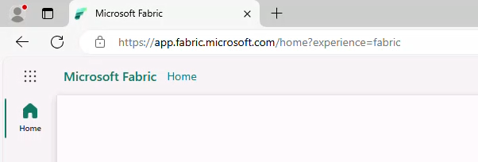

2. Login with provided credentials, if a trial fabric tenant was previously setup (reference Pre-reqs). You may also choose to run the lab in your own Fabric Tenant if you already have one.

3. Click **Real-Time Intelligence**.

   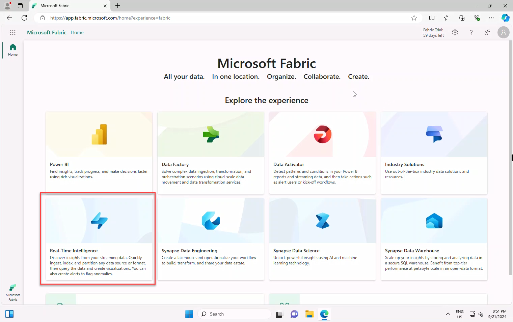

### 2. Fabric Workspace

1. Click **Workspaces** on the left menu and open the Fabric Workspace **designated** to your login by the Fabric Trial Tenant.

| :notebook: **Note**                                                                  |
| :----------------------------------------------------------------------------------- |
| **(Optional) If using your own Fabric Tenant, create a new workspace for this lab.** |

1. To create a new Workspace click on **Workspaces** in the left pane and then click on **+ New Workspace** in the popup window.

   

2. Enter _RTI Tutorial_ as name for the new Workspace. Then extend **Advanced**

   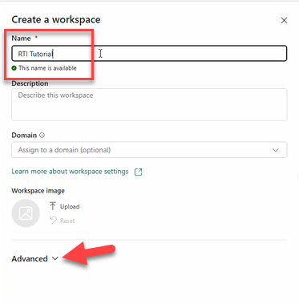

   | :notebook: **Note**                                                                                                                                                                         |
   | :------------------------------------------------------------------------------------------------------------------------------------------------------------------------------------------ |
   | **If the name that you would like to use for your workspace is still available this will be shown below the input box for **Name**. Workspace Names have to be unique in a Fabric tenant.** |

3. Check if the option **Trial** is checked. If so click on **Apply**.

   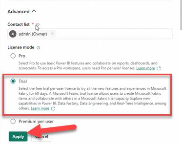

   After you clicked on **Apply** the workspace will be created. This can take up to a minute. The workspace will be opened automatically.

### 3. Create a new Eventhouse

1. To create an Eventhouse click on the button **+ New Item**.

   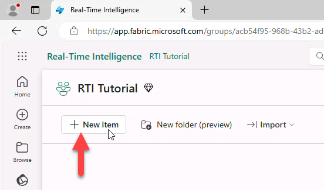

2. In the popup window **New item** select **Eventhouse**

   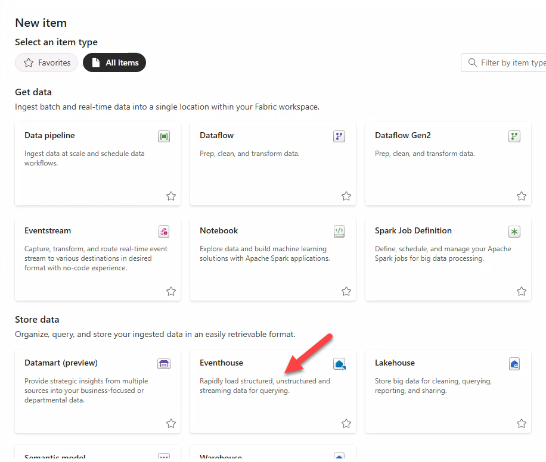

3. In the dialog **New Eventhouse** insert `WebEvents_EH` as name and click on **Create**

   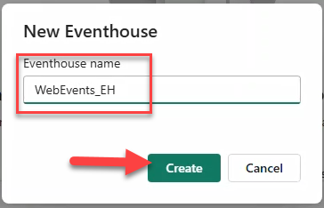

   After the Eventhouse has been created it will be automatically opened.

   | :notebook: **Note**                                                                                                                                                                                                                                                                                                                                                                                                                                                                                                 |
   | :------------------------------------------------------------------------------------------------------------------------------------------------------------------------------------------------------------------------------------------------------------------------------------------------------------------------------------------------------------------------------------------------------------------------------------------------------------------------------------------------------------------ |
   | **The [Eventhouse](https://learn.microsoft.com/en-us/fabric/real-time-intelligence/eventhouse) is designed to handle real-time data streams efficiently, which lets organizations ingest, process, and analyze data in near real-time. Eventhouses are particularly useful for scenarios where **timely insights are crucial**. Eventhouses are **specifically tailored** to time-based, streaming events with multiple data formats. This data is automatically indexed and partitioned based on ingestion time.** |

### 4. Enable OneLake Availability

This feature is also called "one logical copy" and it automatically allows KQL Database tables to be accessed from a Lakehouse, Notebooks, etc in delta-parquet format via OneLake.

- When activated it will constantly copy the KQL data to your Fabric OneLake in delta format. It allows you to query KQL Database tables as delta tables using Spark or SQL endpoint on the Lakehouse. We recommend enabling this feature "before" we load the more data into our KQL Database. Also, consider this feature can be enabled/disabled per table if necessary. You can read more about this feature here: [Announcing Delta Lake support in Real-Time Intelligence KQL Database](https://support.fabric.microsoft.com/blog/announcing-delta-support-in-real-time-analytics-kql-db?ft=All).

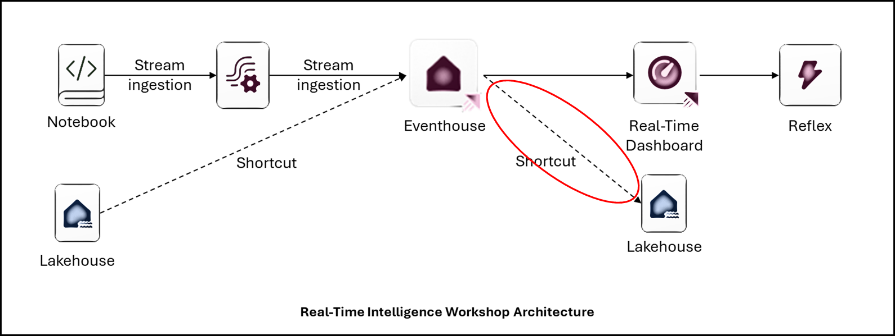

#### Here's how to set this up

1. When an Eventhouse is created, a KQL Database with the same name is created as well. To open the KQL Database click on the Database **WebEvents_EH** in the section **KQL Databases**.

   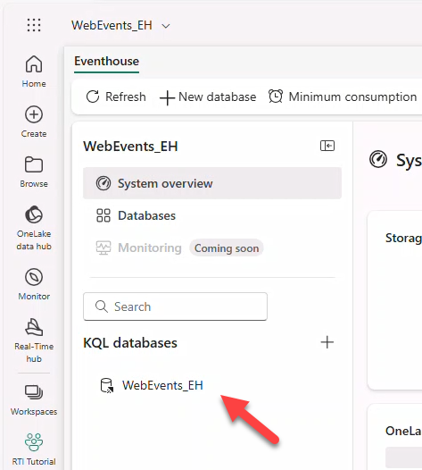

2. After selecting the KQL Database click on the switch **availibility** to activate the OneLake availibility as shown in the screenshot.

   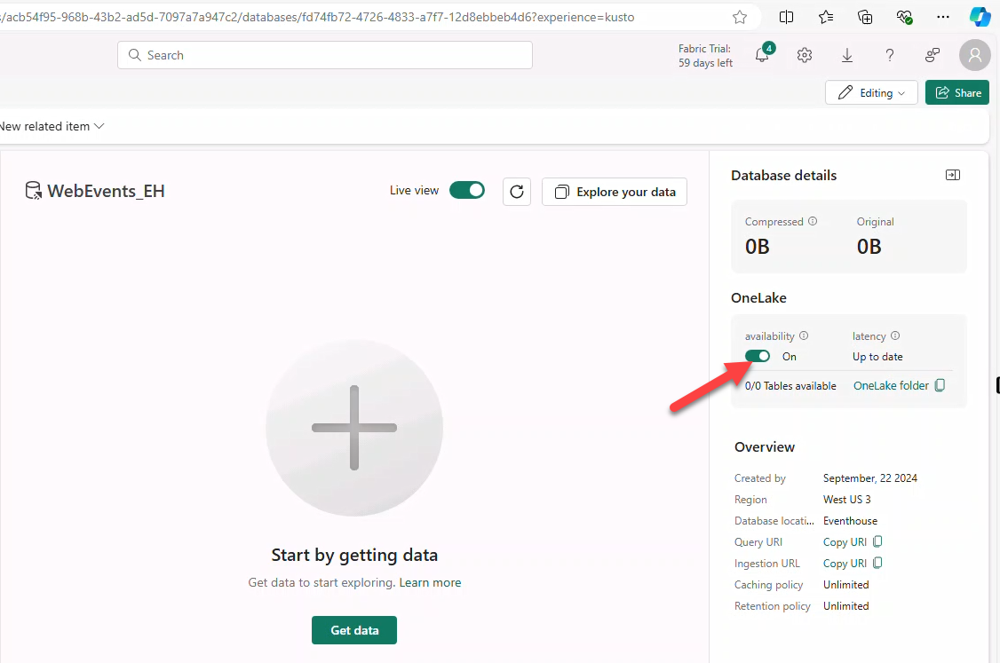

   | :notebook: **Note**                                                                                            |
   | :------------------------------------------------------------------------------------------------------------- |
   | **Newly created tables will automatically inherit the "OneLake availability" setting from the Database level** |

### 5. Create a new Eventstream

In this section we will be streaming events (impressions and clicks events) generated by a notebook. The events will be streamed into an eventstream and consumed by our Eventhouse KQL Database.


1. Select your Workspace in the left pane. In our example it is **RTI Tutorial**. If you are doing the Lab at FabCon please select the workspace that has been provided to you. Then click on **+ New Item**. In the popout window scroll a little bit down and select **Eventstream**.

   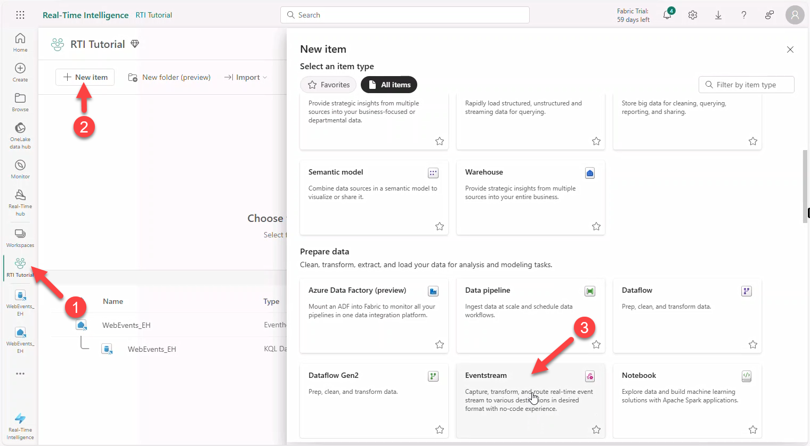

2. Give the Eventstream the name `WebEventsStream_ES`. Make sure that the checkbox **Enhanced Capabilites** is selected and click on **Create**.

   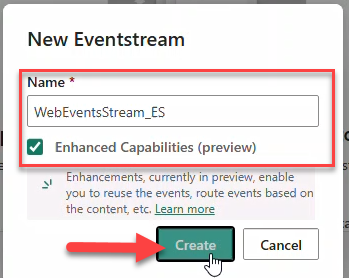

3. On the Screen **Design a flow to ingest, transform, and route streaming events** click on **Use Custom Endpoint**. This will create an event hub connected to the Eventstream.

   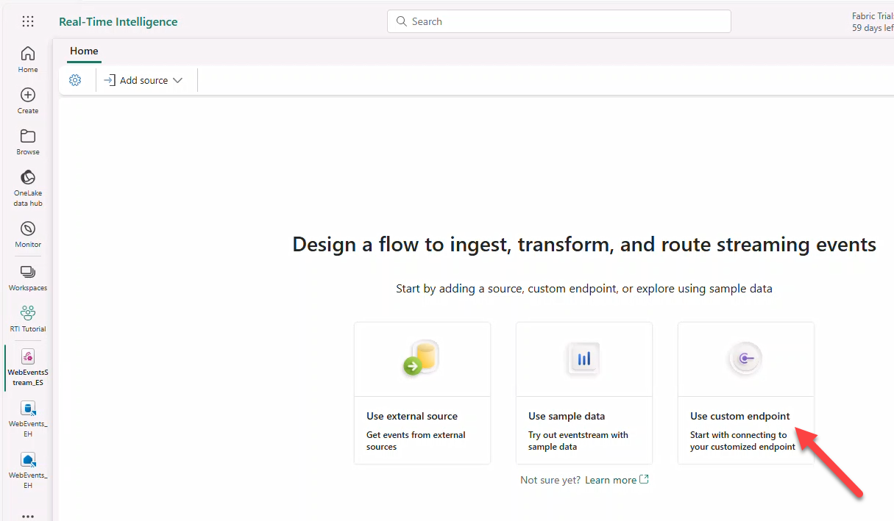

4. Insert `WebEventsCustomSource` as the source name and the click on **Add**.

   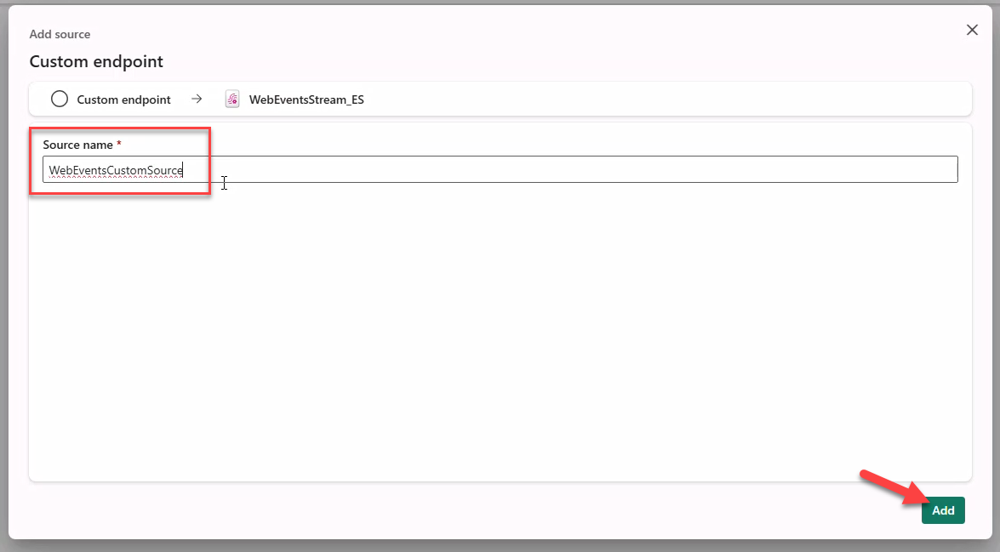

5. Click on **Publish**.

   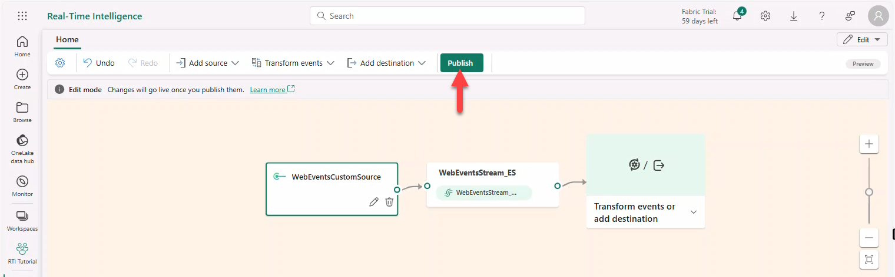

   Now the Eventstream will be published and the Event Hub will be created.

6. To get the information we need for the Notebook, the name of the event hub and a connection string click on the Eventstream source named **WebEventsCustomSource**. In the area below the diagram click on **Keys**. Then click on the copy icon besides the **Event hub name**. Now the event hub name is copied to the clipborad.

   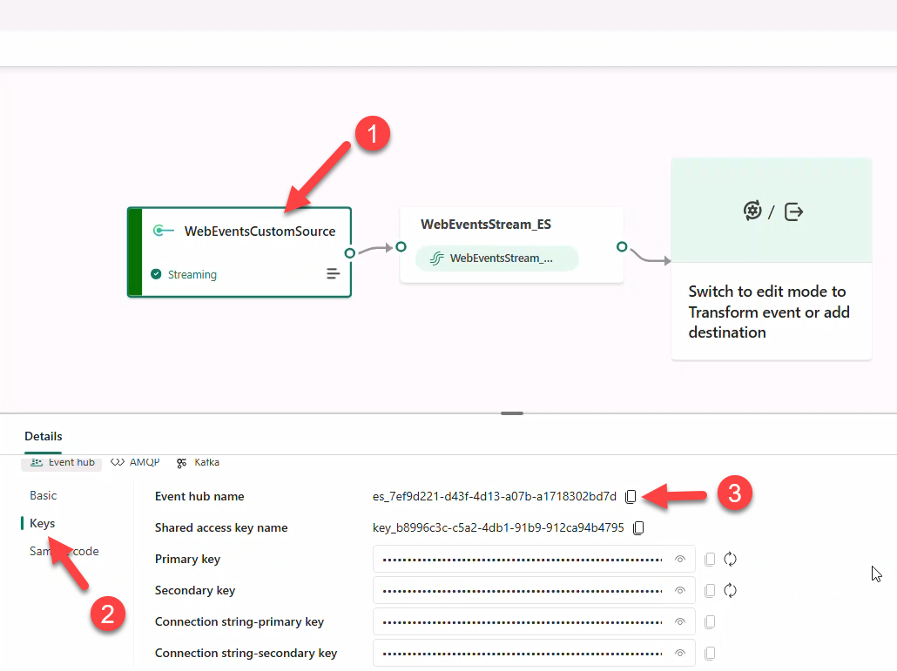

   | :notebook: **Note**                                                                                           |
   | :------------------------------------------------------------------------------------------------------------ |
   | **The easiest way to record the needed values is to just copy them to a notepad window for later reference.** |

7. To copy the connection string you first have to click on the view icon. After the connection string is revealed click on the copy icon and copy the connection string to Notepad as well.

   

| :notebook: **Note**                                                            |
| :----------------------------------------------------------------------------- |
| **It does not matter if you copy the primary or secondary connection string.** |

| :heavy_exclamation_mark: **Important**                |
| :---------------------------------------------------- |
| **To copy the connection string it must be visible.** |

| :information_source: **Information**                                                                             |
| :--------------------------------------------------------------------------------------------------------------- |
| **Eventstreams Custom-Endpoint/Custom-App sources also provide **Kafka** endpoints where data can be pushed to** |

### 6. Import Data Generator Notebook

We use a python notebook to generate a stream of artificial click events. The notebook can be found in this GitHub repository [Generate_synthetic_web_events.ipynb](../notebook/Generate_synthetic_web_events.ipynb).

1. Open the notebook in Github by clicking on this [link](../notebook/Generate_synthetic_web_events.ipynb). In GitHub click on the **Download raw file** icon on the top right.

   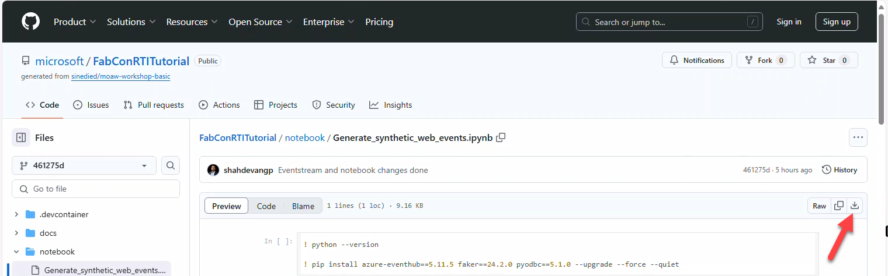

   Save the notebook on your local hard drive. By default it will be stored in the folder **Downloads**.

   Now we have to import the notebook into our Fabric Workspace. To aceive this execute the following steps.

2. To import the notebook into your workspace you first have to return to the workspace. To do so click on the icon of your workspace on the left pane. In our example the workspace is named **RTI Tutorial**. If you do the Lab at FabCon Europe choose the workspace name that was provided to you. After changing to the workspace click on the menu **Import**, select **Notebook** and then the option **From this computer**.

   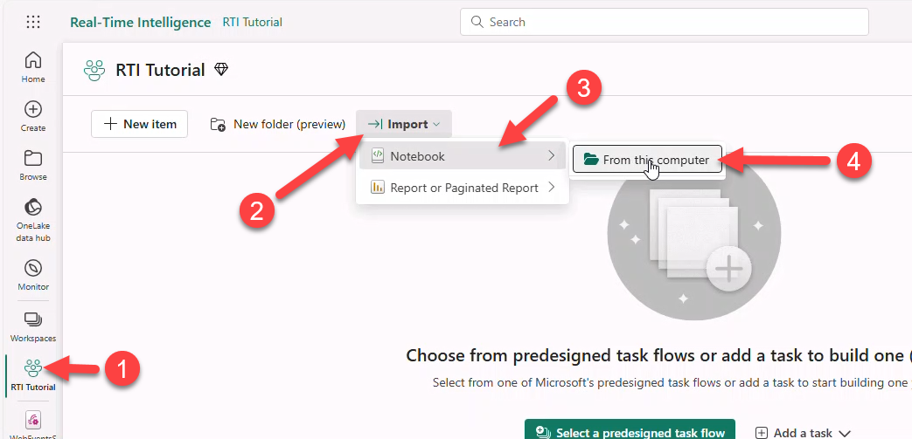

3. In the pane **Import status** on the right side select **Upload**

   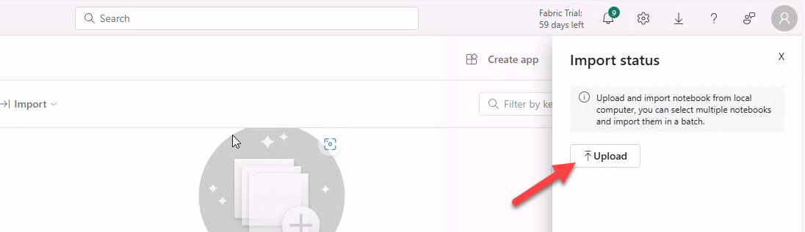

4. Browse to the folder on your local computer where you saved the notebook and select the notebook and click on the button **Open**.

   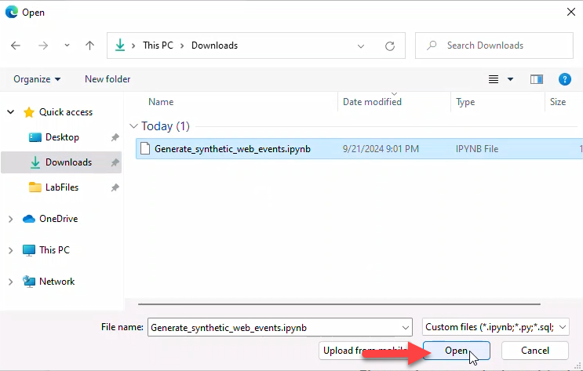

   After the notebook has been uploaded Fabric will display a message that the notebook has been imported successfully.

   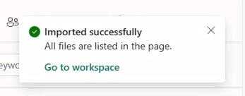

### 7. Run the notebook

Now we have to run the notebook to create the stream of artificial click events for our lab. In order for the Notebook to send the events to the correct Event Hub we have to insert the information we have saved in [Task 5 - Create Event Stream](#5-create-a-new-eventstream).To run the notebook and create our datastream please proceed with the following steps.

| :heavy_exclamation_mark: **Important**                                                                                                        |
| :-------------------------------------------------------------------------------------------------------------------------------------------- |
| **DO NOT use an InPrivate browser window. Recommend using a Personal browser window for the Notebook session to connect & run successfully.** |

1. Click on the Notebook **Generate_synthetic_web_events** in your Fabric Workspace to open it.

   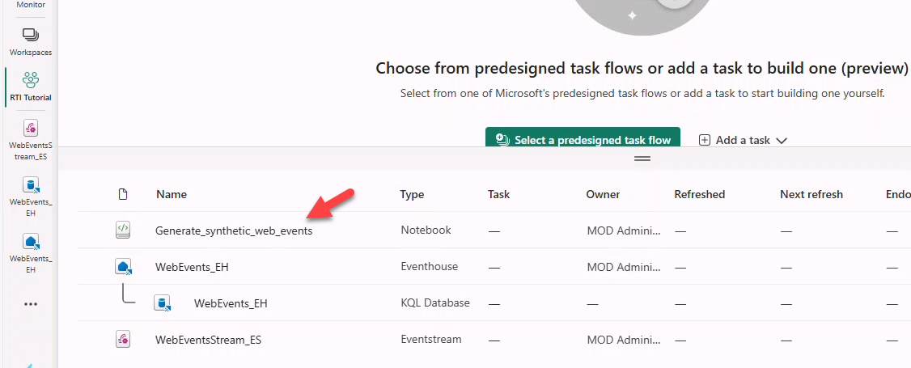

2. Paste in the values your copied in [Task 5 - Create Event Stream](#5-create-a-new-eventstream) as values for `eventHubNameevents` and `eventHubConnString` into the notebook.

   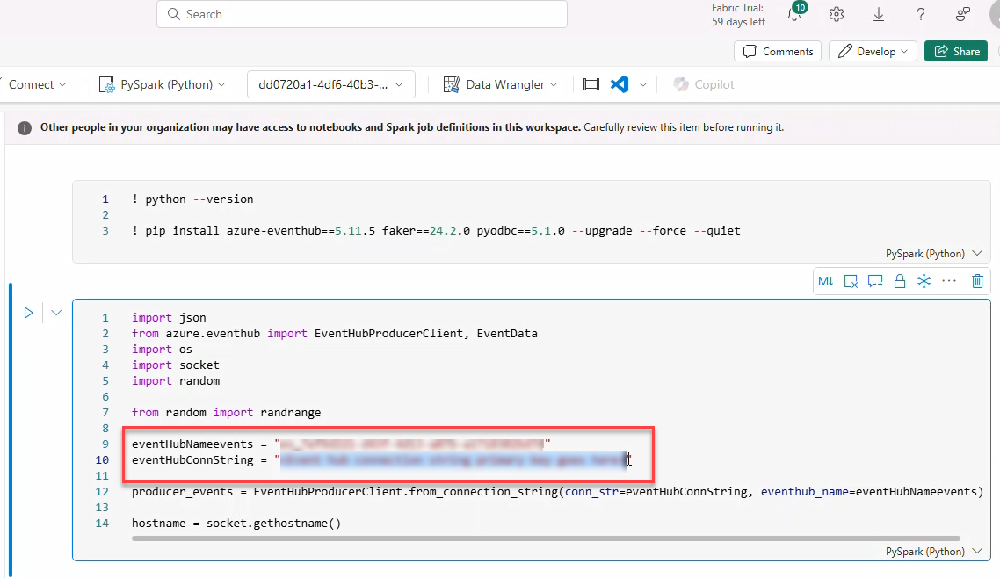

3. Click **Run all** at the top left to start generating streaming events.

   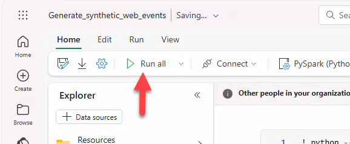

   | :notebook: **Note**                                                                                                                                                                                                                                                                                               |
   | :---------------------------------------------------------------------------------------------------------------------------------------------------------------------------------------------------------------------------------------------------------------------------------------------------------------- |
   | **It can happen that the notebook will throw some errors in cell 1. These errors are caused by libaries that already have been installed in the environment. You can safely ignore these errors. The notebook will execute successfully regardless of these errors.** 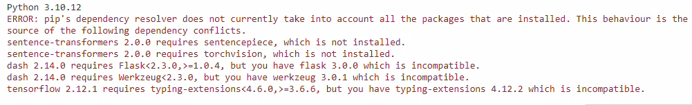 |

   Wait a few minutes for the first code cell to finish and it will proceed to next code cells automatically.

4. Scroll down to the last code cell and it should begin to print the generated synthetic events in JSON format. If you see an output similar to the following screenshot everything is set up and the notebooks streams artificial click data to the event hub.

   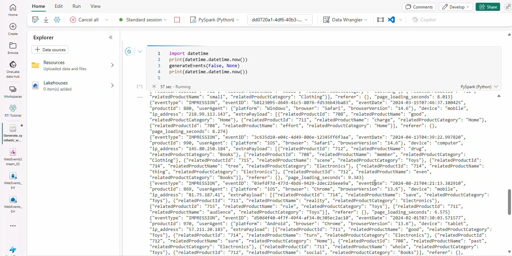

### 8. Define Eventstream topology

Next we have to create the Eventstream topology that will insert the streamed data into our KQL Database. To aceive this please follow the following steps.

1. Open your Eventstream in your Fabric Workspace. To do so click on the icon of your workspace on the left pane. In our example the workspace is named **RTI Tutorial**. If you do the Lab at FabCon Europe choose the workspace name that was provided to you. After changing to the workspace click on the Eventstream **WebEventStream_ES**.

   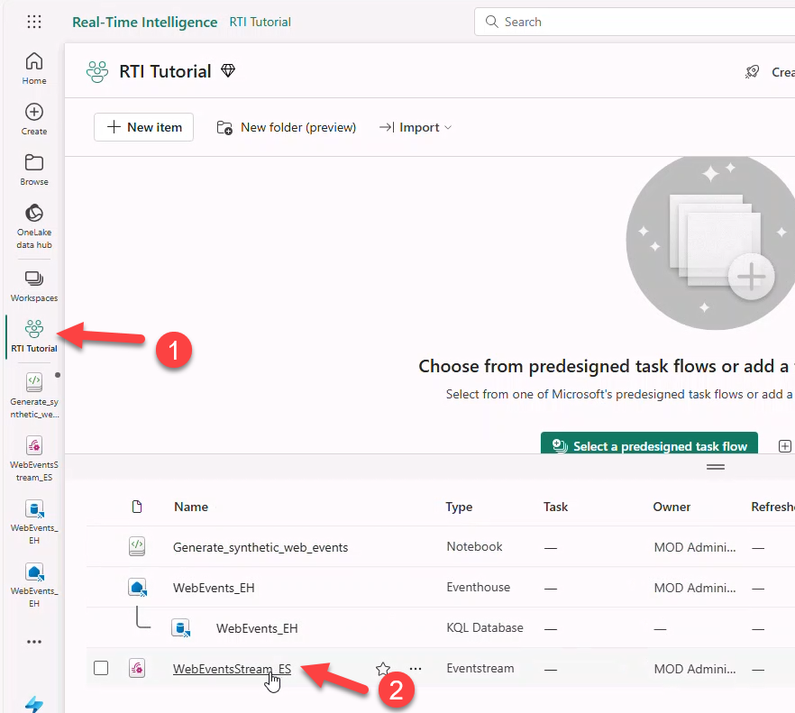

2. Click on **Edit** in the top toolbar.

   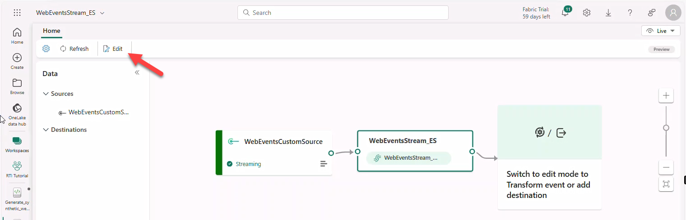

3. Click on the node **Transform events or add Destination** and select **Filter** from the menu.

   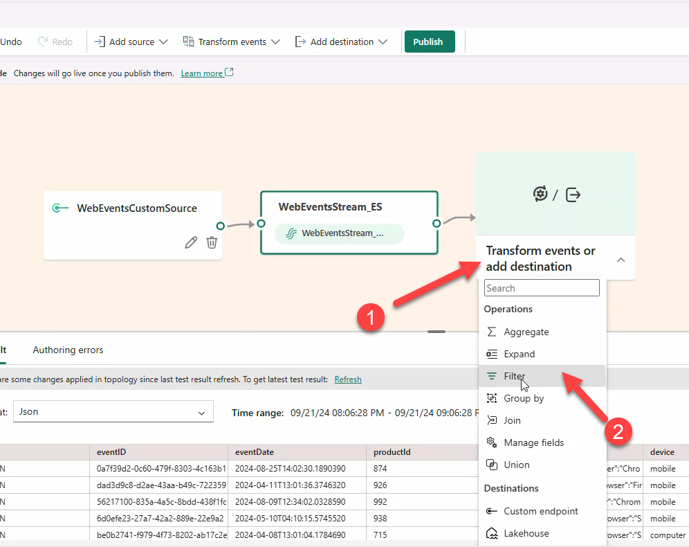

4. Click on the pencil icon the Filter node.

   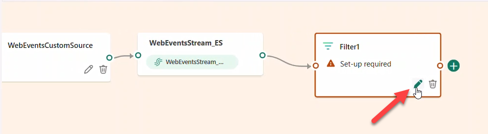

5. Provide the following values in the pane **Filter** on the left side. Then click on **Save**.

   | Field                           | Value               |
   | :------------------------------ | :------------------ |
   | **Operation name**              | `ClickEventsFilter` |
   | **Select a field to filter on** | **eventType**       |
   | **Keep events when the value**  | **equals**          |
   | **value**                       | `CLICK`             |

   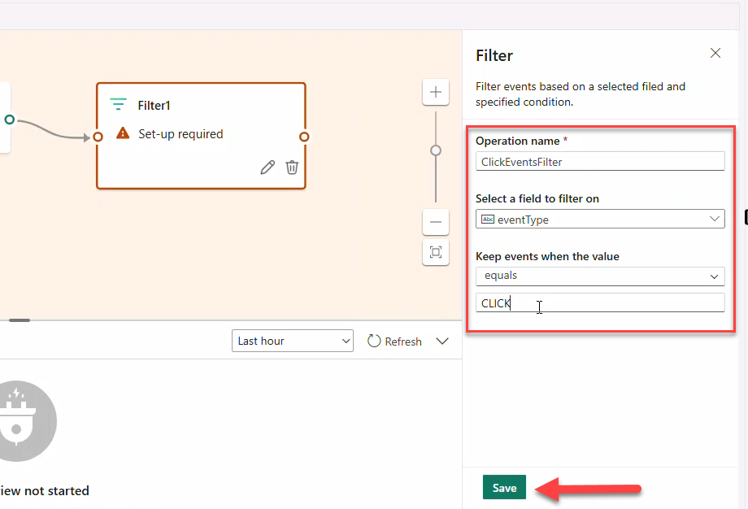

   | :heavy_exclamation_mark: **Important** |
   | :------------------------------------- |
   | **Note: `CLICK` is in ALL CAPS.**      |

6. Click on "+" sign next to the ClickEventsFilter node and choose "Stream".

7. Enter the name as "ClickEventsStream".

8. Click on "+" sign next to the ClickEventsStream node and choose "Eventhouse".

9. Provide "ClickEventStore" as the Destination name.

10. Select your workspace, Eventhouse that we created called "WebEvents_EH" and KQL Database of the same name.

11. Create a new table in our KQL Database called `BronzeClicks`. Click "Save".

12. Click on "+" sign next to the WebEventsStream_ES node and choose "Filter".

13. Delete the connection between this new filter node and ClickEventsFilter node.

14. Connect the output of WebEventsStream_ES node to the input of ClickEventsFilter node.

15. Click on the pencil icon of the new Filter node.

16. Provide "ImpressionEventsFilter" as the Operation name.

17. Choose "eventType" in the drop down for Select a field to filter on.

18. Choose "equals" as the condition

19. Type "IMPRESSION" in the taxt box. Note: "IMPRESSION" is in ALL CAPS.

20. Click on "Save".

21. Click on "+" sign next to the ImpressionEventsFilter node and choose "Stream".

22. Enter the name as "ImpressionEventsStream".

23. Click on "+" sign next to the ImpressionEventsStream node and choose "Eventhouse".

24. Provide "ImpressionEventStore" as the Destination name.

25. Select your workspace, Eventhouse that we created called "WebEvents_EH" and KQL Database of the same name.

26. Create a new table in our KQL Database called `BronzeImpressions`. Click "Save".

27. Click on "Publish".

28. After a few minutes, you should see the ClickEventStore and ImpressionEventStore node changing to mode "Streaming".

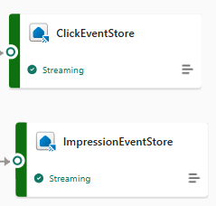

In the end your Eventstream toplogy should appear as shown in the image below.

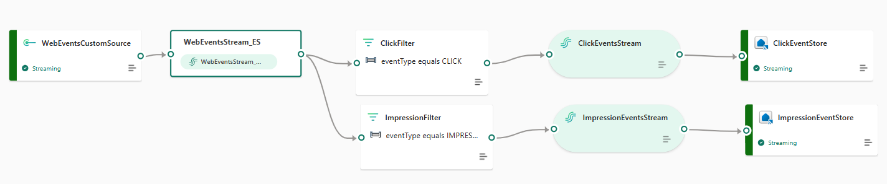

## 8. Setting up the Lakehouse

1. Go to "ref_data" folder in the Github repo and download the products.csv and productcategory.csv files on your computer.

2. Create new Lakehouse called "WebSalesData_LH" in your workspace.

### Uploading reference data files and creating delta tables

3. Click "Get data" and choose "Upload Files"
4. Upload the 2 files that you downloaded in the previous steps.
5. After the files have been uploaded, browse the "Files" folder.
6. Select the "..." context menu for each file and choose "Load to tables".
7. Retain all the default values and click "Load".

Ensure that both the files products.csv and productcategory.csv are available as delta tables in your lakehouse. Eventually, your lakehouse should appear as follows.


### Accessing Eventhouse data from the lakehouse

8. If your Lakehouse is using the Schemas then expand Tables, right-click dbo schema & select "New table shortcut". If Schemas do not appear under Tables, then click on "Get data" drop down, choose **New shortcut**.
9. 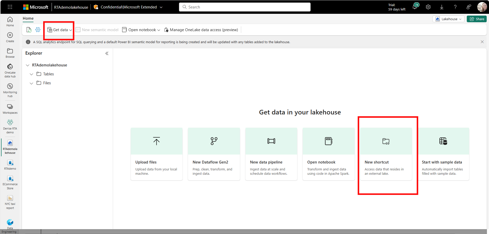
10. Select Microsoft OneLake.
    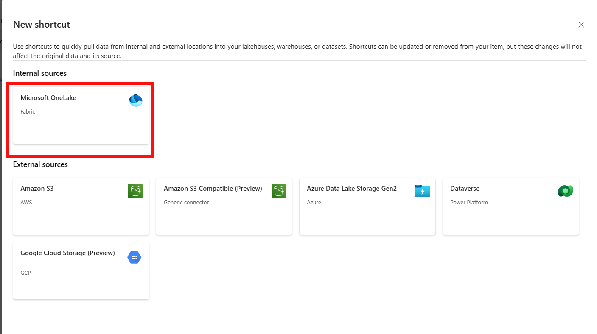
11. Select the "BronzeClicks" and "BronzeImpressions" tables in our Eventhouse KQL Database and click "Next".

<div class="info" data-title="Note">
  
> You may return to this step to create additional shortcuts, after running the [createAll.kql](<https://github.com/microsoft/FabricRTIWorkshop/blob/main/kql/createAll.kql>) database script which will create the additional tables. For now, you may proceed by selecting just the "BronzeClicks" and "BronzeImpressions" tables.
</div>

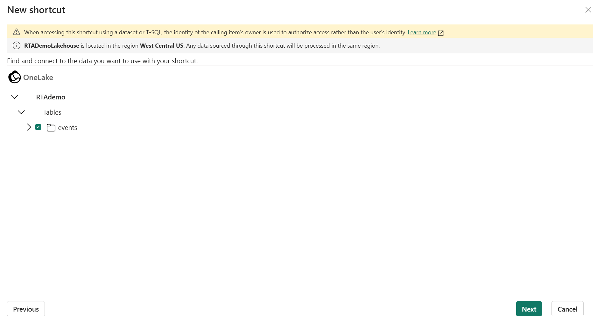

12. Click "Create".
    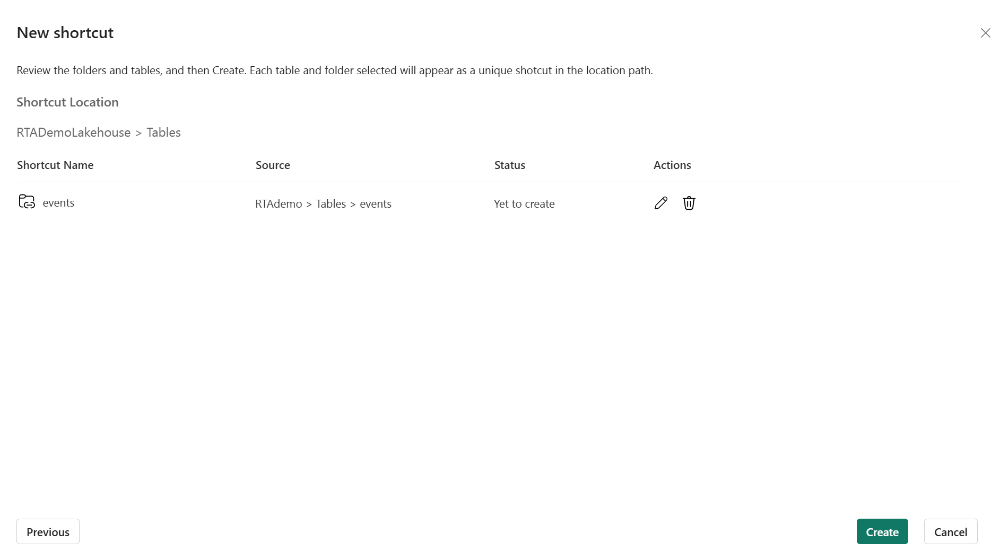

13. Now you will have the Eventhouse KQL Database tables available in your Lakehouse. This also works across workspaces. You can query them like any other Lakehouse table.
    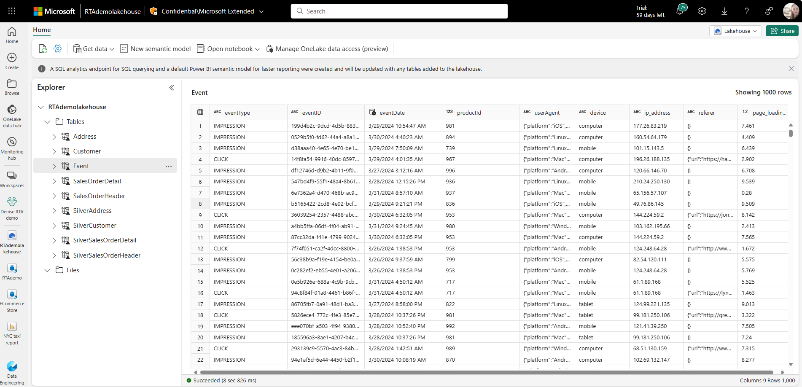

## 9. Build the KQL DB schema

In this section we will create all the silver tables, functions, materialized-views, and enable update policies and in our Eventhouse KQL Database. Two of the tables (product and productCategory) are shortcuts to the lakehouse and the data is NOT being copied into our KQL Database.
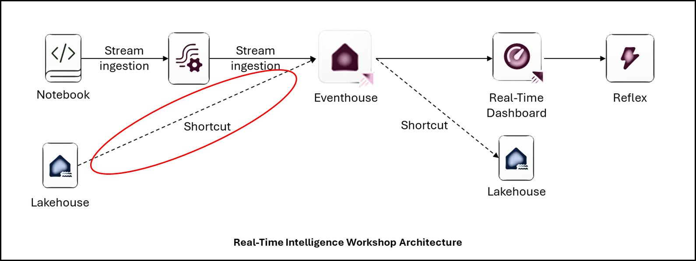

1. Open the WebEvents_EH KQL Database in the Eventhouse of your Fabric Workspace.
2. Click on "New" and choose "OneLake shortcut".
3. Select "Microsoft OneLake".
4. Select "WebSalesData_LH" and click on "Next".
5. Expand Tables, select productcategory table and click on "Create". This will create a shortcut to the table productcategory in your Lakehouse without copying the data from the Lakehouse to Eventhouse.
6. Repeat the above steps to create a similar shortcut to the products table.
7. Expand the Shortcuts branch in the WebEvents_EH tree to verify if the 2 shortcuts have been correctly created.
8. Click on "Explore your Data".  
   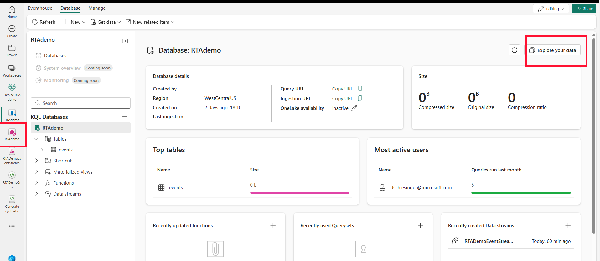
9. Open the [createAll.kql](https://github.com/microsoft/FabConRTITutorial/blob/2452f81b0bf2561ff382988de96f47482d903523/kql/createAll.kql) file in GitHub and click copy icon at the top right to copy the entire file content.
10. Replace all on the "Explore your data" by deleting lines 1-19 and paste the contents of the createAll.kql file.
11. Click Run
    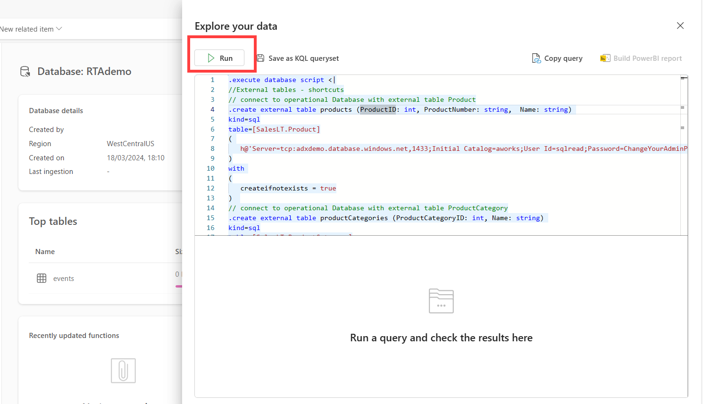
12. Click Save as KQL queryset, name it "createAll".
13. You can add additional tabs in the KQL Queryset to add new queries.
14. Your tables, functions, and materialized views should appear on the database pane on the left.

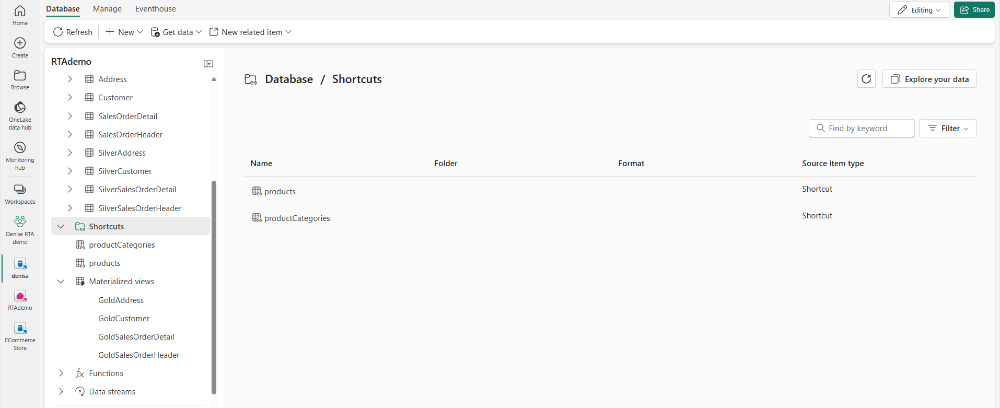 15. (Optional) While on the KQL Database details screen you may explore additional **Real-Time Intelligence Samples** by clicking the **drop-drop next to Get data** and selecting a desired sample. These samples give you the ability to learn more.
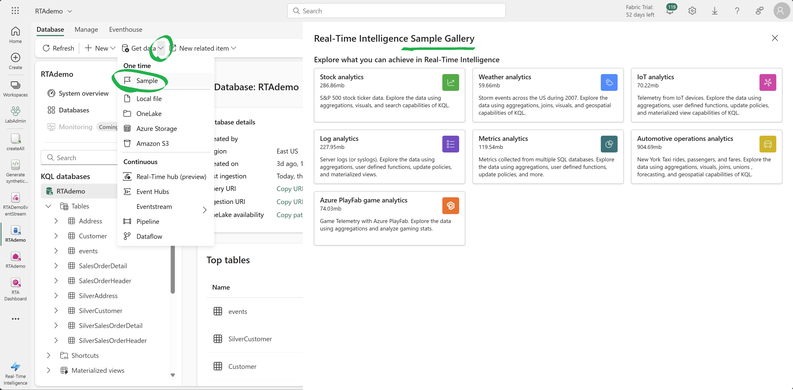

# 10. Real-Time Dashboard

In this section, we will build a real-time dashboard to visualize the streaming data and set it to refresh every 30 seconds. (Optionally) A pre-built version of the dashboard is available to download [here](<https://github.com/microsoft/FabricRTIWorkshop/blob/main/dashboards/RTA%20dashboard/dashboard-RTA Dashboard.json>), which can be imported and configured to your KQL Database data source.

- The Proctor Guide covers this process.
  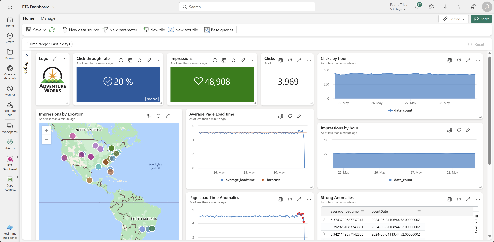

1. Click + Create (button is located at top left Menu underneath Home).
2. Current workspace should be the same one.
3. Scroll down and choose **Real-Time Dashboard**.
4. Name it "Web Events Dashboard".
5. Click **+ Add tile**.
6. Click **+ Data source**.
7. Set the **Database** to "WebEvents_EH" & click Create.
8. Proceed to paste each query below, add a visual, and apply changes. (Optionally) All queries are available in this script file [dashboard-RTA.kql](https://github.com/microsoft/FabricRTIWorkshop/blob/main/dashboards/RTA%20dashboard/dashboard-RTA.kql).

### Clicks by hour

```
//Clicks by hour
SilverClicks
| where eventDate between (_startTime.._endTime)
| summarize date_count = count() by bin(eventDate, 1h)
| render timechart
| top 30 by date_count
```

1. Set Time rage parameter at the top left to **Last 7 days**. This parameter is referenced by the query in the `where` clause by using fields `_startTime` and `_endTime`.
2. Click **Run**.
3. Click **+ Add visual**.
4. Format the visual.
5. Set Tile name to "Click by hour".
6. Set Visual type to **Area chart**.
7. Click **Apply Changes**.

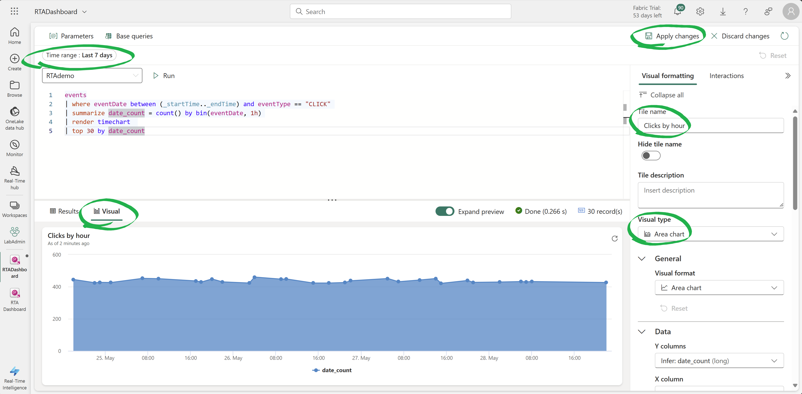

9. While editing the dashboard, click **Manage** on the top left, and click **Parameters**.
10. Edit the "Time range" parameter by setting the Default value to **Last 7 Days**, click Close & Done.

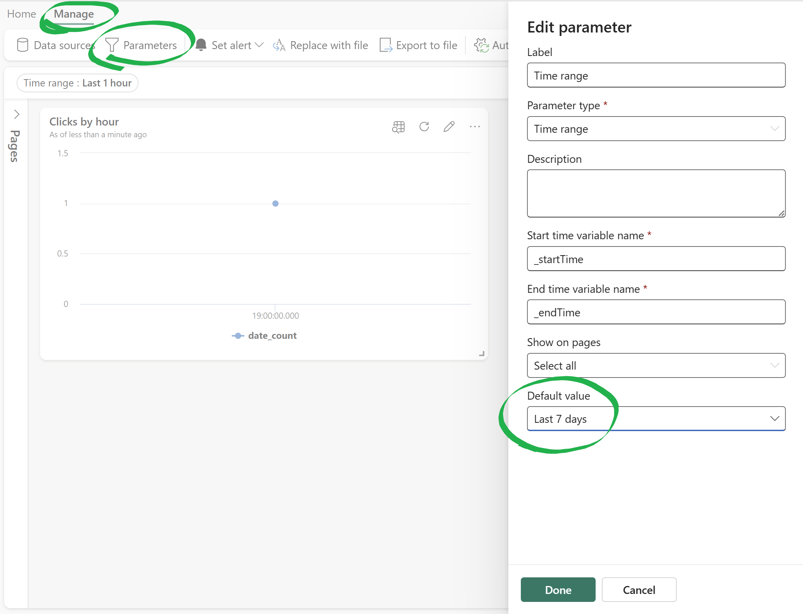

11. Click **+ Add tile** again to proceed with the next visuals.

### Impressions by hour

12. Visual type: **Area chart**.

```
//Impressions by hour
SilverImpressions
| where eventDate between (_startTime.._endTime)
| summarize date_count = count() by bin(eventDate, 1h)
| render timechart
| top 30 by date_count
```

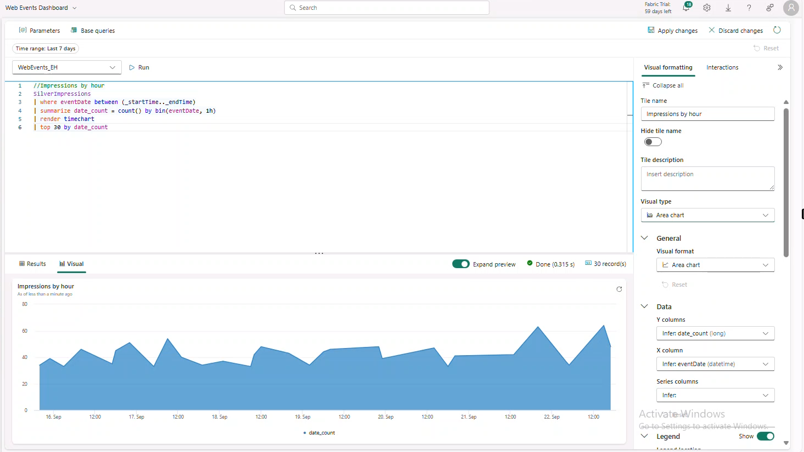

### Impressions by location

12. Visual type: **Map**.

```
//Impressions by location
SilverImpressions
| where eventDate  between (_startTime.._endTime)
| join external_table('products') on $left.productId == $right.ProductID
| project lon = toreal(geo_info_from_ip_address(ip_address).longitude), lat = toreal(geo_info_from_ip_address(ip_address).latitude), Name
| render scatterchart with (kind = map) //, xcolumn=lon, ycolumns=lat)
```

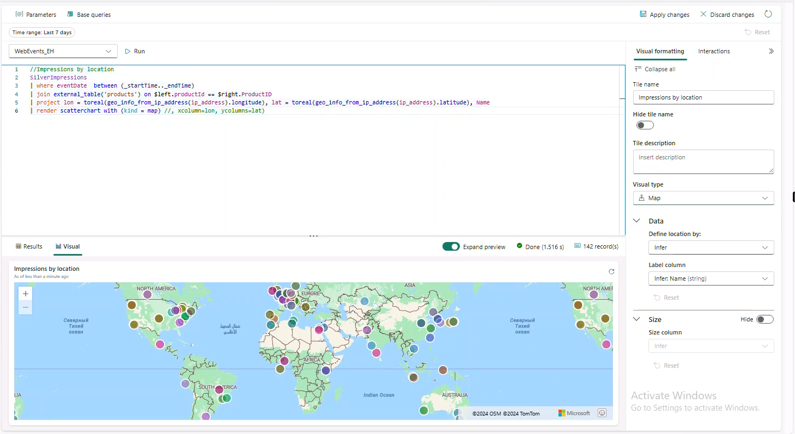

### Average Page Load time

13. Visual type: **Timechart**.

```
//Average Page Load time
SilverImpressions
| where eventDate   between (_startTime.._endTime)
//| summarize average_loadtime = avg(page_loading_seconds) by bin(eventDate, 1h)
| make-series average_loadtime = avg(page_loading_seconds) on eventDate from _startTime to _endTime+4h step 1h
| extend forecast = series_decompose_forecast(average_loadtime, 4)
| render timechart
```

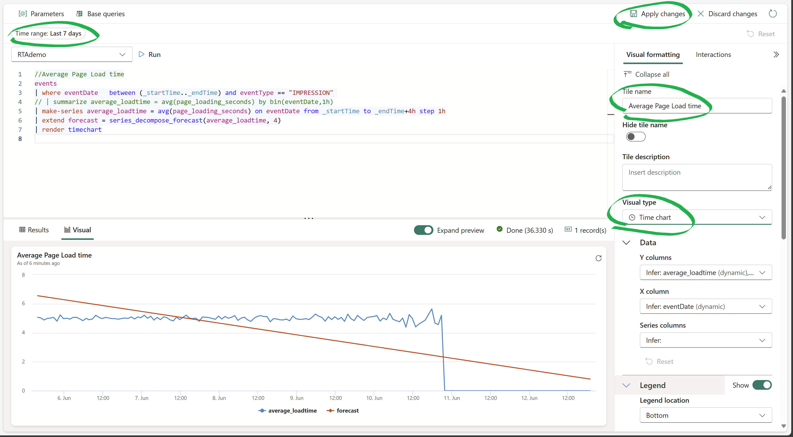

### Impressions, Clicks & CTR

14. Add a tile & paste the query below once. Note, this is a multi-statement query that uses multiple let statements & a query combined by semicolons.
15. Set Tile name: **Impressions**.
16. Visual type: **Stat**.
17. Data Value column to `impressions`.
18. Click **Apply changes**.
19. Click the 3-dots (...) at the top right of the tile you just created to **Duplicate** it two more times.
20. Name the 2nd one **Clicks**, set the Data value column to `clicks`, then Apply changes.
21. Name the 3rd **Click Through Rate**, set the Data value column to `CTR`, then Apply changes.
22. (Optional) On the "Visual formatting" pane, scroll down and adjust the "Conditional formatting" as desired by clicking "+ Add rule".

```
//Clicks, Impressions, CTR
let imp =  SilverImpressions
| where eventDate  between (_startTime.._endTime)
| extend dateOnly = substring(todatetime(eventDate).tostring(), 0, 10)
| summarize imp_count = count() by dateOnly;
let clck = SilverClicks
| where eventDate  between (_startTime.._endTime)
| extend dateOnly = substring(todatetime(eventDate).tostring(), 0, 10)
| summarize clck_count = count() by dateOnly;
imp
| join clck on $left.dateOnly == $right.dateOnly
| project selected_date = dateOnly , impressions = imp_count , clicks = clck_count, CTR = clck_count * 100 / imp_count
```

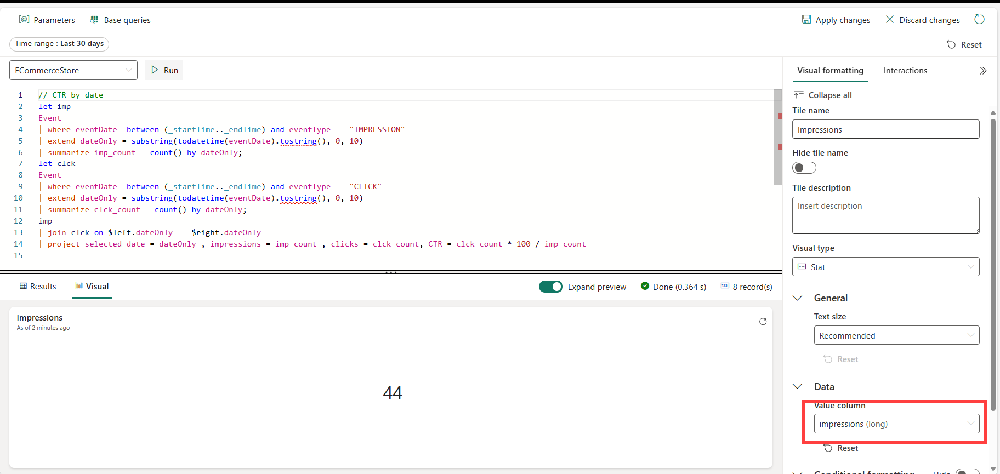
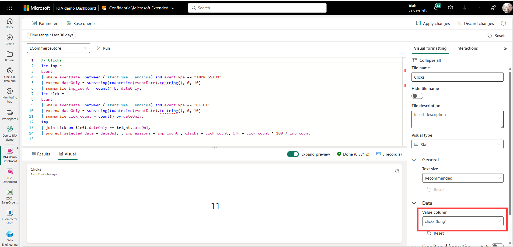
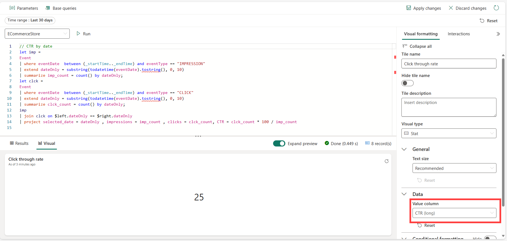

### Average Page Load Time Anomalies

```
//Avg Page Load Time Anomalies
SilverImpressions
| where eventDate   between (_startTime.._endTime)
| make-series average_loadtime = avg(page_loading_seconds) on eventDate from _startTime to _endTime+4h step 1h
| extend anomalies = series_decompose_anomalies(average_loadtime)
| render anomalychart
```

### Strong Anomalies

```
//Strong Anomalies
SilverImpressions
| where eventDate between (_startTime.._endTime)
| make-series average_loadtime = avg(page_loading_seconds) on eventDate from _startTime to _endTime+4h step 1h
| extend anomalies = series_decompose_anomalies(average_loadtime,2.5)
| mv-expand eventDate, average_loadtime, anomalies
| where anomalies <> 0
| project-away anomalies
```

### Logo (Markdown Text Tile)

```
//Logo (Markdown Text Tile)

```

> The title can be resized on the dashboard canvas directly, rather than writing code.

### Auto-refresh

22. While editing the dashboard, click **Manage** > **Auto refresh**.
23. Set it to **Enabled**, and **Default** refresh rate to **30 seconds**, click Apply.
24. Click **Home** and then **Save**.

## 11. Reflex

1. While editing the dashboard, click **Manage** > Set Alert.
2. Choose "Clicks by hour".
3. Select Condition "Becomes greater than".
4. Set Value to 250.
5. Action choose **Message me in Teams**.
6. Click Create.

<div class="info" data-title="Note">
  
> The Reflex item will appear in your workspace and you can edit the Reflex trigger action. The same Reflex item can also trigger multiple actions. 
</div>

## 12. Stop the notebook

At this point you've completed the lab, so you may stop running the notebook.

1. Open the notebook "Generate synthetic events" from your workspace and click **Stop** on the last code cell if its still running.
2. (Optionally) You can click **Cancel All** on the top menu or click the stop red-square button to Stop session. These only appear when your session is active or the notebook is running.
   
3. (Optionally) "LabAdmin" can click **Monitor** on the left Menu, search for "generate", click the 3-dots (...) next to the notebook "In progress" status and click **Cancel**.
   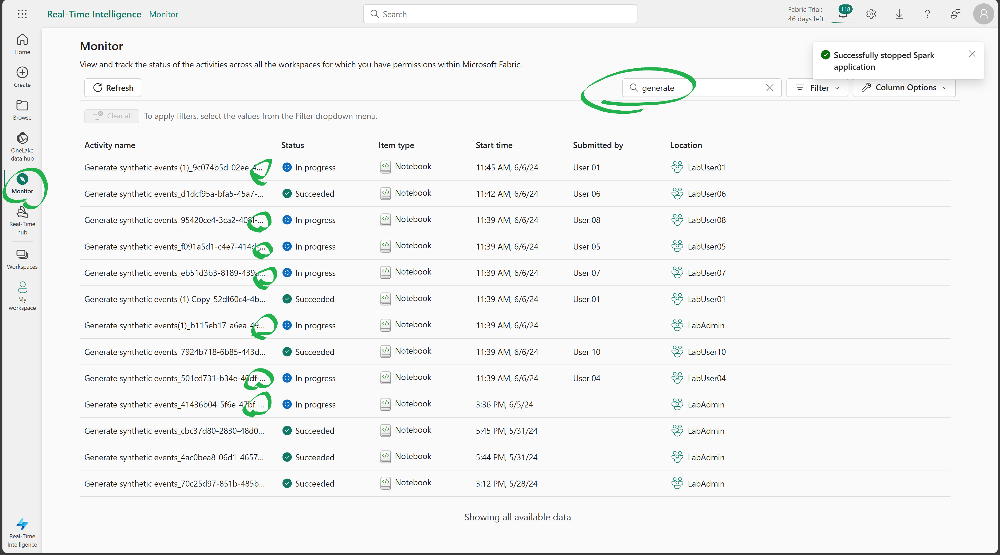

## THAT's ALL FOLKS!!

---

# Continue your learning

- [Implement a Real-Time Intelligence Solution with Microsoft Fabric](https://aka.ms/realtimeskill/)
- [Real-Time Intelligence documentation in Microsoft Fabric](https://aka.ms/fabric-docs-rta)
- [Microsoft Fabric Updates Blog](https://aka.ms/fabricblog)
- [Get started with Microsoft Fabric](https://aka.ms/fabric-learn)
- [The mechanics of Real-Time Intelligence in Microsoft Fabric](https://youtube.com/watch?v=4h6Wnc294gA)
- [Real-Time Intelligence in Microsoft Fabric](https://youtube.com/watch?v=ugb_w3BTZGE)

### Thank you!


