# Introduction

Suppose you own an e-commerce website selling bike accessories. You have millions of visitors a month, you want to analyze the website traffic, consumer patterns and predict sales.  

This workshop will walk you through the process of building an end-to-end [Real-Time Intelligence](<https://blog.fabric.microsoft.com/en-us/blog/introducing-real-time-intelligence-in-microsoft-fabric>) Solution in MS Fabric, using the medallion architecture, for your e-commerce website.  

You will learn how to:
- Build a web traffic analytics solution using Fabric Real-Time Intelligence. 
- **TO BE CHANGED** Use Fabric shortcuts & Data Factory pipelines to get data from operational DBs like SQL Server (with AdventureWorksLT sample data).
- Stream events into Fabric Eventhouse via Eventstream & leverage OneLake availability.
- Create real-time data transformations in Fabric Eventhouse through the power of Kusto Query Language (KQL) & Fabric Copilot.
- Create real-time visualizations using Real-Time Dashboards and automate actions.

See what real customers like [McLaren](<https://www.linkedin.com/posts/shahdevang_if-you-missed-flavien-daussys-story-at-build-activity-7199013652681633792-3hdp>), [Dener Motorsports](<https://customers.microsoft.com/en-us/story/1751743814947802722-dener-motorsport-producose-ltd-azure-service-fabric-other-en-brazil>), [Elcome](<https://customers.microsoft.com/en-us/story/1770346240728000716-elcome-microsoft-copilot-consumer-goods-en-united-arab-emirates>), [Seair Exim Solutions](<https://customers.microsoft.com/en-us/story/1751967961979695913-seair-power-bi-professional-services-en-india>) & [One NZ](<https://customers.microsoft.com/en-us/story/1736247733970863057-onenz-powerbi-telecommunications-en-new-zealand>) are saying.

All the **code** in this tutorial can be found here:   
[Building a Medallion Architecture on Fabric Real-Time Intelligence](<https://github.com/microsoft/FabConRTITutorial/>)  

### Duration
- Workshop 5-6 hours.
- Each section is accompanied with technical explanation of the Fabric Real-Time Intelligence component being used.
- Without the accompanied explanation, lab can be completed in 1-2 hours.
- **TO BE CHANGED** [pre-reqs](<https://moaw.dev/workshop/?src=gh%3Amicrosoft%2FFabricRTIWorkshop%2Fmain%2Fdocs%2F&step=6>) 30-45 minutes (section 7, recommend provisioning trial tenant prior if necessary).

### Original Creators
This workshop/tutorial was originally written by the following authors and is available at [Fabric-RTI-Workshop](<https://aka.ms/fabricrtiworkshop>)
- [Denise Schlesinger](<https://github.com/denisa-ms>), Microsoft, Principal CSA
- [Hiram Fleitas](<https://aka.ms/hiram>), Microsoft, Senior CSA
- Guy Yehudy, Microsoft, Principal PM

### Authors
- [Brian Bønk Rueløkke](<https://www.linkedin.com/in/brianbonk/>), Data Platform MVP
- [Devang Shah](<https://www.linkedin.com/in/shahdevang/>), Principal Program Manager, Microsoft
- [Frank Geisler](<https://www.linkedin.com/in/frank-geisler/>), Data Platform MVP
- [Johan Ludvig Brattås](<https://www.linkedin.com/in/johanludvig/>), Data Platform MVP
- [Matt Gordon](<https://www.linkedin.com/in/sqlatspeed/>), Data Platform MVP

### Contributing
- If you'd like to contribute to this lab, report a bug or issue, please feel free to submit a Pull-Request to the [GitHub repo](<https://github.com/microsoft/FabConRTITutorial/>) for us to review or [submit Issues](<https://github.com/microsoft/FabConRTITutorial/issues>) you encounter.

---

## Fabric Real-Time Intelligence

Let's cover the key-features of Real-Time Intelligence and how we plan to use them for our architecture.

### Eventstreams
- Eventstreams allows us to bring real-time events (including Kafka endpoints) into Fabric, transform them, and then route them to various destinations without writing any code (no-code).
- In this solution, Clicks and Impressions events are ingested from an Eventstream into the respective 'BronzeClicks' and 'BronzeImpressions' tables.
- Enhanced capabilities allows us to source data into Eventstreams from Azure Event Hubs, IoT Hubs, Azure SQL Database (CDC), PostgreSQL Database (CDC), MySQL Database (CDC), Azure Cosmos Database (CDC), Google Cloud Pub/Sub, Amazon Kinesis Data Streams, Confluent Cloud Kafka, Azure Blog Storage events, Fabric Workspace Item events, Sample data or Custom endpoint (Custom App).
- Feature [documentation](<https://learn.microsoft.com/fabric/real-time-analytics/event-streams/overview>).

### Shortcuts
- Shortcuts enable the creation of a live connections between OneLake and data sources, whether internal or external to Azure. This allows us to retrieve data from these locations as if they were seamlessly integrated into Microsoft Fabric.
- A shortcut is a schema entity that references data stored external to a KQL database in your cluster. In Lakehouse(s), Eventhouse(s), or KQL Databases it's possible to create shortcuts referencing internal locations within Microsoft Fabric, ADLS Gen2, Spark Notebooks, AWS S3 storage accounts, or Microsoft Dataverse.
- By enabling us to reference different storage locations, OneLake's Shortcuts provides a unified source of truth for all our data, within the Microsoft Fabric environment and ensures clarity regarding the origin of our data.
- In this solution, the `Product` and `ProductCategory` delta tables in OneLake are defined as external tables using shortcuts. Meaning the data is not copied but served from the OneLake itself. Shortcuts allow data to remain stored in outside of Fabric, yet presented via Fabric as a central location.
- Feature [documentation](<https://learn.microsoft.com/fabric/real-time-analytics/onelake-shortcuts?tabs=onelake-shortcut>).

### Eventhouse
- An Eventhouse can host multiple KQL Databases for easier management. It will store events data from the Eventstream, leverage shortcuts and automate transformations in real-time. Eventhouses are **specifically tailored** to time-based, streaming or batch events with structured, semi-structured, and unstructured data.
- An Eventhouse is the best place to store streaming data in Fabric. It provides a highly scalable analytics system with built-in Machine Learning capabilities for discrete analytics over highly-granular data. It's useful for any scenario that includes event-based data, for example, telemetry and log data, time series and IoT data, security and compliance logs, or financial records. 
- Eventhouse's support Kusto Query Language (KQL) queries, T-SQL queries and Python. The data is automatically made available in delta-parquet format and can be easily accessed from Notebooks for more advanced transformations. 
- Feature [documentation](<https://learn.microsoft.com/fabric/real-time-intelligence/eventhouse>).

### KQL Update policies
- This feature is also known as a mini-ETL. Update policies are automation mechanisms, triggered when new data is written to a table. They eliminate the need for external orchestration by automatically running a query to transform the ingested data and save the result to a destination table.
-  Multiple update policies can be defined on a single table, allowing for different transformations and saving data to multiple tables simultaneously. **Target** tables can have a different schema, retention policy, and other policies than the **Source** table.
-  In this solution, the data in derived silver layer tables (targets) of our medallion architecture is inserted upon ingestion into bronze tables (sources). Using Kusto's update policy feature, this appends transformed rows in real-time into the target table, as data is landing in a source table. This can also be set to run in as a transaction, meaning if the data from bronze fails to be transformed to silver, it will not be loaded to bronze either. By default, this is set to off allowing maximum throughput.
- Feature [documentation](<https://learn.microsoft.com/azure/data-explorer/kusto/management/update-policy>).

### KQL Materialized Views
- Materialized views expose an aggregation query over a source table, or over another materialized view. We will use materialized views to create the Gold Layer in our medallion architecture. Most common materialized views provide the current reading of a metric or statistics of metrics over time. They can also be backfilled with historical data; however, by default they are automatically populated by newly ingested data.
- Feature [documentation](<https://learn.microsoft.com/azure/data-explorer/kusto/management/materialized-views/materialized-view-overview>).

### One Logical Copy
- This feature creates a one logical copy of KQL Database data by turning on OneLake availability. Turning on OneLake availability for your KQL tables, database or Eventhouse means that you can query the data in your KQL database in Delta Lake format via other Fabric engines such as Direct Lake mode in Power BI, Warehouse, Lakehouse, Notebooks, and more. When activated, it will copy via mirroring the KQL data to your Fabric Datalake in delta-parquet format. Allowing you to shortcut tables from your KQL Database via OneLake to your Fabric Lakehouse, Data Warehouse, and also query the data in delta-parquet format using Spark Notebooks or the SQL-endpoint of the Lakehouse.
- Feature [documentation](<https://learn.microsoft.com/fabric/real-time-analytics/one-logical-copy>).

### KQL Dynamic fields
- Dynamic fields are a powerful feature of KQL database's that support evolving schema changes and object polymorphism, allowing the storage/querying of different event types that have a common denominator of base fields.
- Feature [documentation](<https://learn.microsoft.com/azure/data-explorer/kusto/query/scalar-data-types/dynamic>).

### Kusto Query Language (KQL)
- KQL is also known as the language of the cloud. It's available in many other services such as Microsoft Sentinel, Azure Monitor, Azure Resource Graph and Microsoft Defender. The code-name **Kusto** engine was invented by 4 engineers from the Power BI team over 10 years ago and has been implemented across all Microsoft services including Github Copilot, LinkedIn, Azure, Office 365, and XBOX.
- KQL queries are easy to write, read and edit. The language is most commonly used to analyze logs, sign-on events, application traces, diagnostics, signals, metrics and much more. Supports multi-statement queries, relational operators such as filters (where clauses), union, joins aggregations to produce a tabular output. It allows the ability to simply pipe (|) additional commands for ad-hoc analytics without needing to re-write entire queries. It has similarities to PowerShell, Excel functions, LINQ, function SQL, and OS Shell (Bash). It supports DML statements, DDL statements (referred to as Control Commands), built-in machine learning operators for forecasting & anomaly detection, plus more... including in-line Python & R-Lang.
- In this solution, KQL commands will be automatically created and executed by eventstream to ingest data when configuring the Eventhouse KQL Database destination in the Eventstream. These commands will create the respective 'bronze' tables. Secondly, the control commands will be issued in a database script that automate creation of additional schema items such as Tables, Shortcuts, Functions, Policies and Materialized-Views.
- Feature [documentation](<https://learn.microsoft.com/azure/data-explorer/kusto/query/>).

### Real-Time Dashboards

- While similar to Power BI's dashboard functionality, Real-time Dashboards have a different use case. Real-time Dashboards are commonly used for operational decision making, rather than the business intelligence use cases Power BI targets. Power BI supports more advanced visualizations and provides a rich data-story capabilities. Real-time Dashboards refresh very fast and allow with ease to toggle between visuals, and analysts to pro-developer can explore/edit queries without needing to download a desktop tool. This makes the experience simpler for analysts to understand and visualize large volumes of highly-granular data.
- In this solution, the Real-time dashboard will contain a collection of visual tiles _Click Through Rate_ stat KPIs, _Impressions_ area chart, _Clicks_ area chart, _Impressions by Location_ map for geo-spatial analytics and _Average Page Load Time_ in a line chart. This feature supports filter parameters, additional pages, markdown tiles, including Plotly, multiple KQL datasources, base queries, embedding.
- Real-time Dashboard's also support sharing while retaining permission controls, setting of alerts via Data Activator, and automatic refresh with a minimum frequency of 30 seconds. 
- Feature [documentation](<https://learn.microsoft.com/fabric/real-time-intelligence/dashboard-real-time-create>).

### Data Activator
- Data Activator (code-name Reflex) is a no-code experience in Microsoft Fabric for automatically taking actions when patterns or conditions are detected in changing data. It monitors data in Power BI reports, Eventstreams items and Real-time Dashboards, for when the data hits certain thresholds or matches other patterns. It then triggers the appropriate action, such as alerting users or kicking off Power Automate workflows.
- Some common use cases are:
  - Run Ads when same-store sales decline.
  - Alert store managers to move food from failing freezers before it spoils.
  - Retain customers who had a bad experience by tracking their journey through apps, websites etc.
  - Help logistics companies find lost shipments proactively by starting an investigation when package status isn't updated for a certain length of time.
  - Alert account teams when customers fall behind with conditional thresholds.
  - Track data pipeline quality, to either re-run jobs, alert for detected failures or anomalies.
- In this solution, we will set an alert in our Real-time Dashboard to **Message me in Teams** functionality.
- Feature [documentation](<https://learn.microsoft.com/fabric/data-activator/data-activator-introduction>).

### Copilot
- Copilot for Real-Time Intelligence is an advanced AI tool designed to help you explore your data and extract valuable insights. You can input questions about your data, which are then automatically translated into Kusto Query Language (KQL) queries. Copilot streamlines the process of analyzing data for both experienced KQL users and citizen data scientists.
- Feature [documentation](<https://learn.microsoft.com/fabric/get-started/copilot-real-time-intelligence>).

---

# The e-commerce store   

The e-commerce store database entities are:  
- **Product:** the product catalogue. 
- **ProductCategory:** the product categories.  
- **events:** a click or impression event.   
  - An **impression event** is logged when a product appears in the search results.
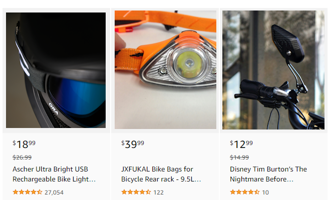  
  - A **click event** is logged when the product is clicked and the customer has viewed the details.  
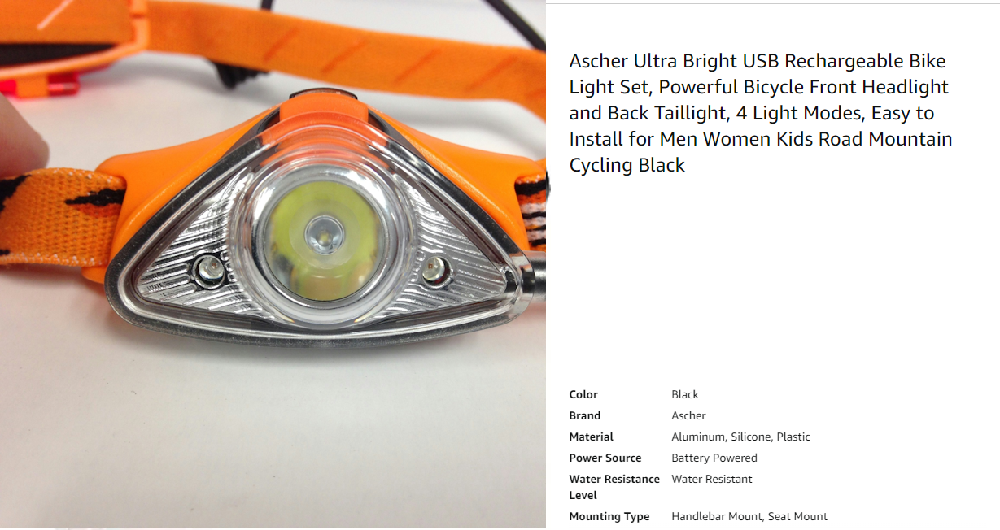  

Photo by <a href="https://unsplash.com/@himiwaybikes?utm_content=creditCopyText&utm_medium=referral&utm_source=unsplash">Himiway Bikes</a> on <a href="https://unsplash.com/photos/black-and-gray-motorcycle-parked-beside-brown-wall-Gj5PXw1kM6U?utm_content=creditCopyText&utm_medium=referral&utm_source=unsplash">Unsplash</a>.  
Photo by <a href="https://unsplash.com/@headaccessories?utm_content=creditCopyText&utm_medium=referral&utm_source=unsplash">HEAD Accessories</a> on <a href="https://unsplash.com/photos/silver-and-orange-head-lamp-9uISZprJdXU?utm_content=creditCopyText&utm_medium=referral&utm_source=unsplash">Unsplash</a>.  
Photo by <a href="https://unsplash.com/@jxk?utm_content=creditCopyText&utm_medium=referral&utm_source=unsplash">Jan Kopřiva</a> on <a href="https://unsplash.com/photos/a-close-up-of-a-helmet-with-sunglasses-on-it-CT6AScSsQQM?utm_content=creditCopyText&utm_medium=referral&utm_source=unsplash">Unsplash</a>.
  

---

### Components of Fabric's Real-Time Intelligence
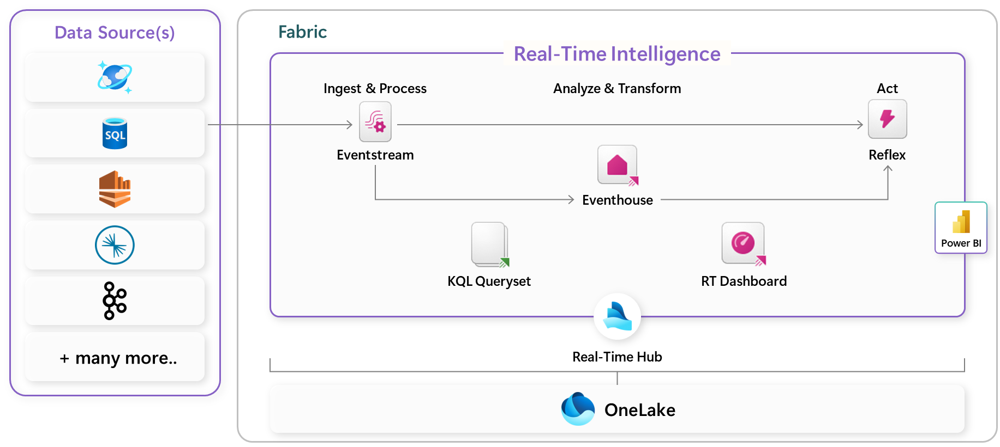
Real-Time Intelligence allows organizations to ingest, process, analyze, ask questions over your data using natural language, transform and automatically act on data. All with a central hub (Real-Time Hub) to easily access and visualize all internal and external, first- and third-party streaming data. 

Using Real-Time Intelligence enables faster, more accurate decision-making and accelerated time to insight.

### Lab Architecture
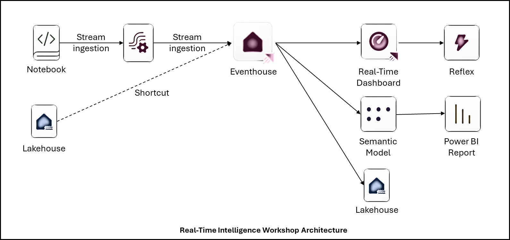
Now with Data Activator (Reflex), we can also set alerts on Real-time Dashboards to send a message in Teams with conditional thresholds or even more advanced actions. 

---

# Data schema

### Data flow
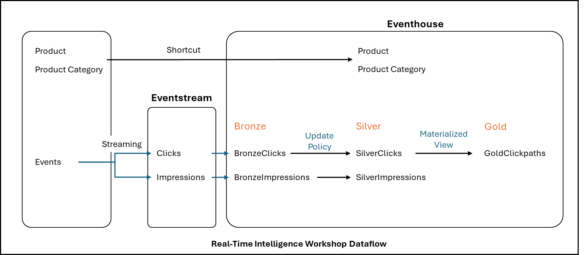  

### Tables
| Table| Origin     | Description|
|------|------------|------------|
| **BronzeClicks**|Eventhouse table|Streaming events representing the product being seen or clicked by the customer. Will be streamed into Fabric Eventhouse from an eventstream. We'll use a Fabric Notebook to simulate and push synthetic data (fake data) into an endpoint.|
| **BronzeImpressions**|Eventhouse table|Streaming events representing the product being seen or clicked by the customer. Will be streamed into Fabric Eventhouse from an eventstream. We'll use a Fabric Notebook to simulate and push synthetic data (fake data) into an endpoint.|
| **SilverClicks**|EventHouse table|Table created based on an update policy with **transformed data**.|
| **SilverImpressions**|EventHouse table|Table created based on an update policy with **transformed data**.|

### External Tables
| Table| Origin     | Description|
|------|------------|------------|
| **Product**|**Shortcut** to OneLake delta table|Products, including descriptions and prices.|
| **ProductCategory**|**Shortcut** to OneLake delta table|Product category.|

### Functions
| Function| Description|
|------------|------------|
|**expandClickpath**|Expands JSON array of dictonaries to transform into strongly typed columns.|
|**expandRelatedProducts**|Expands JSON array of dictonaries to transform into strongly typed columns|

### Materialized-Views
| View | Origin     | Description|
|------|------------|------------|
| **ToBeDefined**|Eventhouse silver table|Materialized view showing only the **latest** changes in the source table showing how to handle duplicate or updated records.|
| **ToBeDefined**|Eventhouse silver table|Materialized view showing only the **latest** changes in the source table showing how to handle duplicate or updated records.|

---

# Pre-requisites
- Recommended material to review (at least one) prior to this lab, however it's not required:
  - [Write your first query with Kusto](<https://aka.ms/learn.kql>)
  - [Implement a Real-Time Intelligence Solution Tutorial](<https://learn.microsoft.com/fabric/real-time-intelligence/tutorial-introduction>)
- To complete the lab you **must** have access to a [Microsoft Fabric](<https://www.microsoft.com/microsoft-fabric/getting-started>) workspace with at least Contributor permissions.

### Fabric tenant and capacity for the tutorial
For the purpose of this tutorial, speakers/proctors will provide a tenant with capacity for you to build your solution.

---

# Building the platform
## 1. Login to Lab Environment

  
> Do **not** use an InPrivate browser window. Recommend using a Personal browser window to successfully run this lab.

1. Proceed to [app.fabric.microsoft.com](<https://app.fabric.microsoft.com/>). 
2. Login with provided credentials, if a trial fabric tenant was previously setup (reference Pre-reqs). You may also choose to run the lab in your own Fabric Tenant if you already have one.
3. Click **Real-Time Intelligence**.
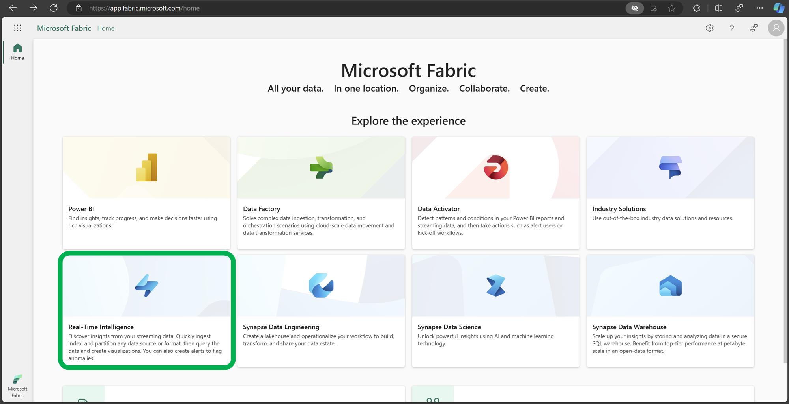

## 2. Fabric Workspace 
1. Click **Workspaces** on the left menu and open the Fabric Workspace **designated** to your login by the Fabric Trial Tenant.
2. (Optional) If using your own Fabric Tenant, create a new workspace for this lab. 
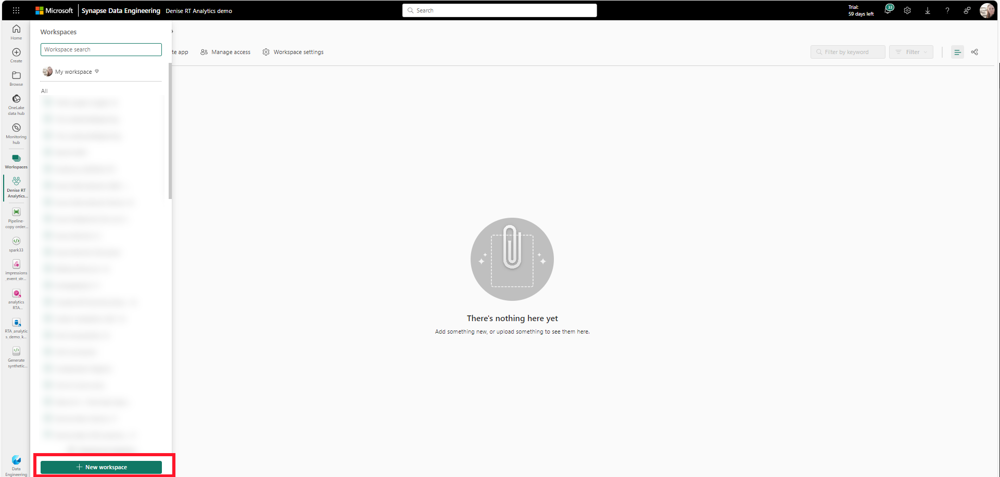

## 3. Create a new Eventhouse  
1. Create an Eventhouse called "RTAdemo".  
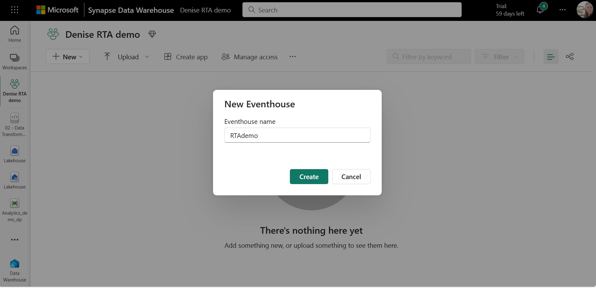
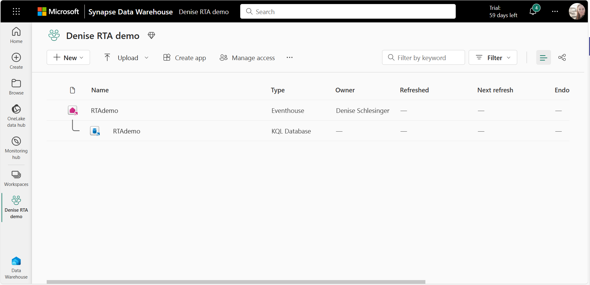

  
> The [Eventhouse](<https://learn.microsoft.com/en-us/fabric/real-time-intelligence/eventhouse>) is designed to handle real-time data streams efficiently, which lets organizations ingest, process, and analyze data in near real-time. Eventhouses are particularly useful for scenarios where **timely insights are crucial**. Eventhouses are **specifically tailored** to time-based, streaming events with multiple data formats. This data is automatically indexed and partitioned based on ingestion time.

## 4. Create a new Eventstream 
In this section we will be streaming events (impressions and clicks events) generated by a notebook. The events will be streamed into an eventstream and consumed by our Eventhouse KQL Database.
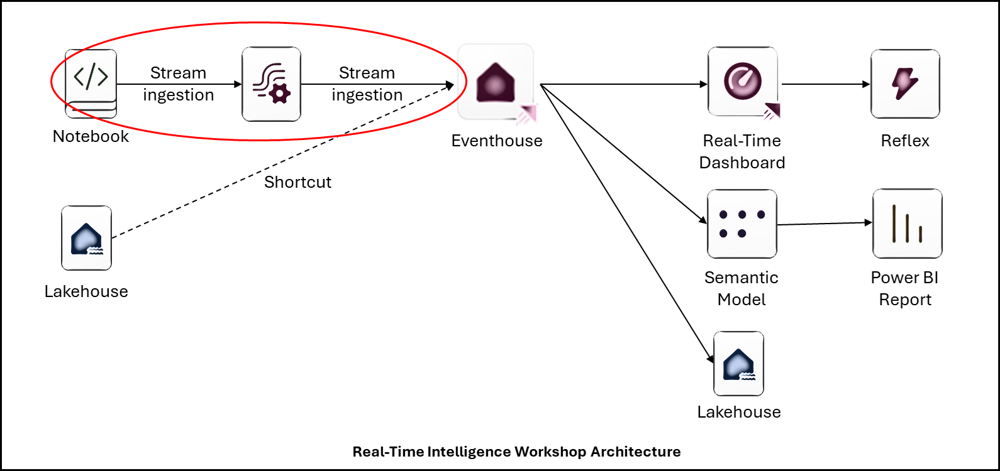

1. Create an Eventstream called "RTADemoEventStream".  
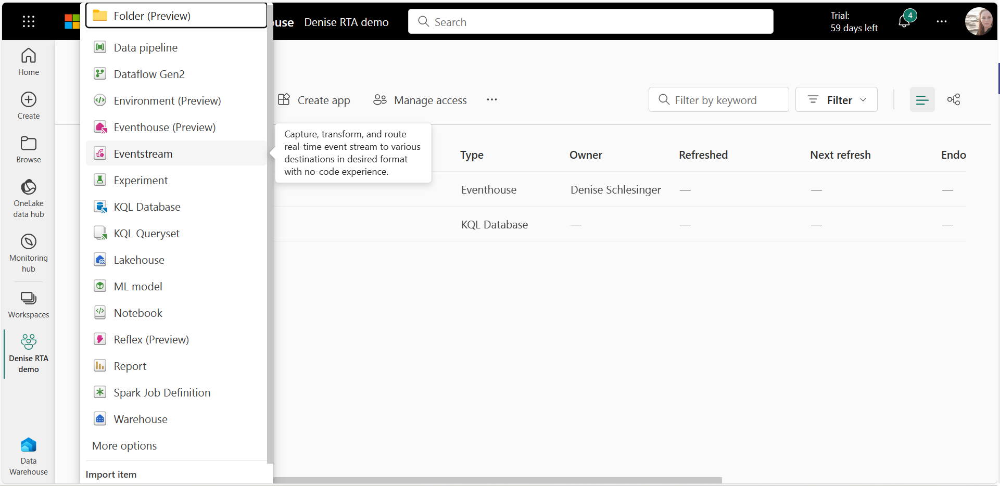
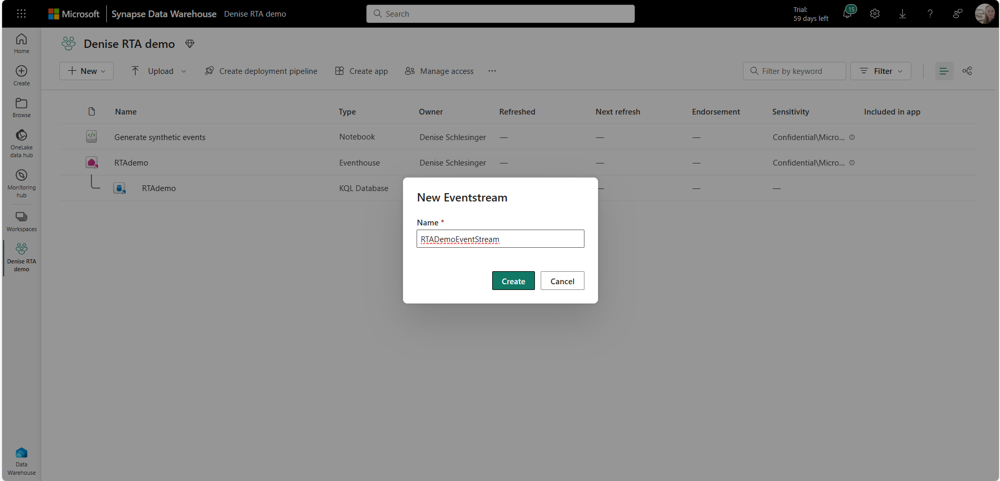